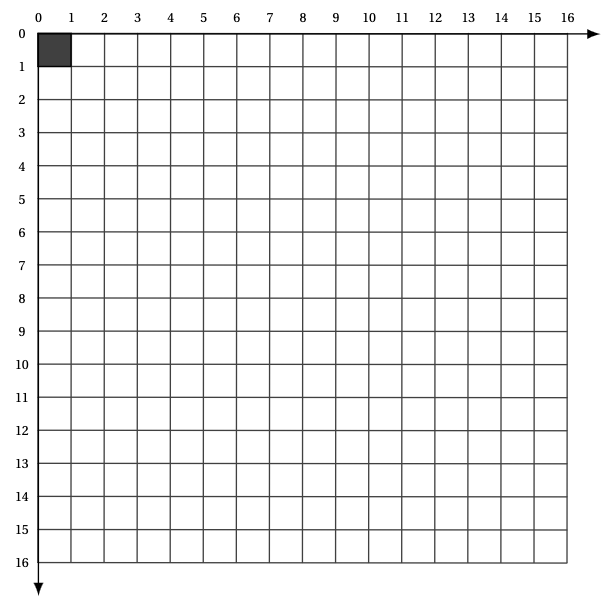
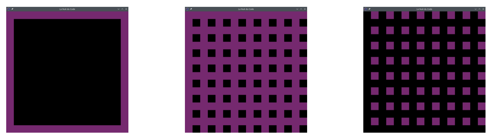

= Prise en main Pyxel, shoot-em up
:last-update-label!:
:linkattrs:
:toc: left
:toc-title: Table des matières
:icons: font
:stem: latexmath
:source-highlighter: pygments
:pygments-style: monokai
:sectnums:
:experimental:


== Introduction

On se propose dans ce TP de réaliser un jeu en utilisant la librairie Pyxel, qui sera utilisée
lors de la nuit du code. Toutes les fonctions proposées par cette librairie se trouvent dans le
paragraphe intitulé https://github.com/kitao/pyxel/blob/main/docs/README.fr.md#documentation-de-lapi[documentation de l’api]


Tous les codes seront écrits dans un fichier commençant par:

[source,python]
----
import pyxel

----

Il est possible d'utiliser le module pyxel en ligne via: https://www.pyxelstudio.net/new-project[pyxelstudio] ou de
l'installer directement sur la machine via le gestionnaire de package Thonny.


== Initialisation de l'application

La fonction ```init``` du module pyxel initialise l’application Pyxel avec un écran de taille ```(width,
height)```. Il est possible de passer comme options : le titre de la fenêtre avec ```title```, le nombre
d’images par seconde avec ```fps```, la touche pour quitter l’application avec ```quit_key```, l’échelle de
l’affichage avec ```display_scale```.

Nous appelerons en suite la fonction ```run``` avec pour arguments la fonction update nécessaire pour mettre à
jour chaque frame et la fonction ```draw``` pour dessiner sur l’écran quand c’est nécessaire (cf section
suivante).
La nuit du code impose l’utilisation d’une fenêtre de taille ```(128, 128)```, ayant pour titre ```"La Nuit
du Code"```.

Vous pouvez tester le code suivant, qui devrait afficher un carré en haut à gauche sur un fond noir:

[source,python]
----
import pyxel


pyxel.init(128, 128, title="Nuit du c0de")


def update():
    """mise à jour des variables (30 fois par seconde)"""
    pass

def draw():
    """ Affiche les éléments dans la fenêtre graphique """
    pyxel.cls(0) # vide la fenêtre
    pyxel.rect(0, 0, 10, 10, 3) # affiche un carré en haut à gauche


pyxel.run(update, draw)
----

=== Méthode draw et update


L’instruction ```pyxel.rect(x, y, w, h, col)``` dessine un rectangle de largeur ```w```,
de hauteur ```h``` et de couleur ```col``` à partir de ```(x, y)``` (coin supérieur gauche). Les couleurs par défaut (elles sont paramétrables) sont données dans la documentation de la librairie pyxel.

image:https://github.com/kitao/pyxel/raw/main/docs/images/05_color_palette.png[couleur pyxel de base]

WARNING: L’origine du repère est le coin supérieur gauche de la fenêtre. Les axes du repère de la
fenêtre graphique sont orientés vers la droite et vers le bas. Ainsi, l’instruction permettant de
dessiner le pixel noir de la figure ci-dessous est pyxel.rect(0, 0, 1, 1, 0)




=== Exercice 1

Compléter le code de la méthode ```draw``` de telle sorte que l’affichage réalisé lors de
l’exécution du programme soit ("l’épaisseur" des traits est de 8 pixels) :



== Le vaisseau


Le vaisseau manipulé par le joueur possède une position ```(x, y)``` à l’écran. Il faut pouvoir le
deplacer selon une direction et l’afficher à l’écran. La taille du vaisseau sera fixé à 8 pixels
par 8 pixels. Initialement on représente le vaisseau à l’aide d’un carré de couleur, on verra par
la suite comment utiliser une image pour l’affichage.

La position du vaisseau sera stocké dans deux variables globales ```x_vais``` et ```y_vais```.


[source,python]
----
import pyxel


pyxel.init(128, 128, title="Nuit du c0de")
x_vais, y_vais = 56, 112

def update():
    """mise à jour des variables (30 fois par seconde)"""
    pass

def draw():
    """ Affiche les éléments dans la fenêtre graphique """
    pass


pyxel.run(update, draw)
----

=== Affichage du vaisseau

Écrire une fonction ```afficher``` qui affiche un carré d’une certaine couleur de taille (8, 8) (en
pixels) à la position ```(x_vais, y_vais)``` du vaisseau. La couleur choisie sera la valeur par défaut 5.


[source,python]
----
def afficher():
    """ Affiche le vaisseau à l'écran """
----

Modifier la fonction ```draw``` de façon à quelle appelle la fonction afficher.

=== Déplacement du vaisseau

Écrire une fonction ```deplacer``` qui met à jour les coordonnées du vaisseau suivant le déplacement ```direction```. ```direction``` est un couple d’entiers (dx, dy) : on incrémente x_vais de dx et y_vais de dy.

[source,python]
----
def deplacer(dx, dy):
    """ deplace le vaisseau """
    global x_vais, y_vais # permet de faire référence aux variables globales
----

=== Exercice 2

. Modifier les méthodes ```update``` et ```draw``` de telle sorte qu’à chaque frame: on déplace le personnage suivant la direction ```(1, -1)``` et on l’affiche à sa position courante. Que constate-t-on ? Ajouter l’instruction pyxel.cls(0) pour corriger ce problème.
. Modifier l’argument optionnel fps de la fonction pyxel.init : tester avec les valeurs fps=1, fps=5, et fps=10.


== Commande clavier


On cherche maintenant à déplacer le vaisseau à l’aide des touches du clavier. L’instruction ```pyxel.btn(key)``` renvoie ```True``` si la touche ```key``` est appuyée, sinon renvoie ```False```. On trouve (entre
autres) dans la liste des touches les constantes :

* ```pyxel.KEY_RIGHT```
* ```pyxel.KEY_LEFT```
* ```pyxel.KEY_DOWN```
* ```pyxel.KEY_UP```


=== Exercice 3

[source,python]
----
def vaisseau_deplacement():
    """déplacement avec les touches de directions"""
    if pyxel.btn(pyxel.KEY_RIGHT):
        deplacer(1, 0)
----

. Compléter le code de la fonction suivante, de sorte que le vaisseau se déplace vers la gauche, le bas et le haut
selon les touches correspondantes. (la fonction ```vaisseau_deplacement```) devra être appelé par la fonction ```update```.
. Que se passe-t-il quand le vaisseau est sur le point de disparaitre de l'écran ? Modifier la fonction ```vaisseau_deplacement```
de façon à ce que quand le vaisseau sort par la droite il revienne par la gauche, et qu'il ne puisse pas «sortir de l'écran» par
le haut et par le bas.

== Ajouter des images

Nous allons maintenant essayer de faire en sorte que notre vaisseau n'ait plus l'apparence d'un carré mais d'un vaisseau.
Pour cela nous allons charger une banque de ressource proposant une image de vaisseau.

Une tuile (tile en anglais) est un élément graphique d'un jeu vidéo, constitué de petites images (en général) carrées disposées sur une grille.

Une tuile peut représenter un sprite ou un élément de décor, avec lequel on peut interagir ou non. L'ensemble complet des tuiles disponibles pour une utilisation dans une zone de jeu est appelé un jeu de tuiles (ou tileset en anglais).


Pour ce tutoriel nous allons utiliser le jeu d'image suivant: link:https://nuit-du-code.forge.apps.education.fr/DOCUMENTATION/PYTHON/TUTORIELS/tutoriel-detaille-terminale/scripts/images.pyxres[fichier ressource].
Le télécharger et le placer dans le même répertoire que votre code

L’éditeur Pyxel peut créer des images et des sons utilisables dans des applications Pyxel. (voir la documentation Pyxel)
La commande suivante permet de visualiser et même éditer ce fichier ressource.

[source]
----
pyxel edit images.pyxres
----

Lors de l'initialisation du jeu, il est nécessaire de charger en mémoire le fichier de ressources.
Pour faire cela, il faut placer la ressource dans le même répertoire que votre code. Puis placer la ligne suivant
après la ligne ```pyxel.init(...)``` correspondant à l'initialisation.

[source,python]
----
# chargement des images
pyxel.load("images.pyxres")
----

Pour afficher l'image sur notre fenêtre de jeu nous allons utiliser la fonction suivante ```blt(x, y, img, u, v, w, h, [colkey])```, où:

* x et y sont les coordonnées où seront placées l'images
* img permet de préciser le fichier ressource utilisé lorsqu'il y en a plusieurs, nous n'en avons qu'un. On mettera donc la valeur à 0.
* (u, v) correspond aux coordonnées du pixel haut-gauche de la zone sélectionnée dans l'image.
* (w, h) correspond à la largeur et la hauteur de cette zone.

Ainsi avec les valeurs u=0, v=8, w=8, h=8, on aura la zone de l'image correspondant à un monstre vert avec des yeux rouges.
Quelles valeurs prendre pour obtenir l'image correspondant à un vaisseau ?

Utiliser cette image pour représenter le vaisseau.


== Ajouter des ennemis

En vous inspirant de ce qui a été fait précédement ajouter des ennemis. Les ennemis doivent apparaitre aléatoirement dans le temps en haut de
l'écran (mais à une abscisse aléatoire) et descrendre jusqu'à sortir de l'écran par le bas.
Pour cela, on créera une liste correspondant à une variable globale ```ennemis```.

== Ajouter des tirs

Ajouter des tirs. Pour cela, on créera une liste correspondant à une variable globale ```tirs```.


== Ajouter du son

Il est possible de rajouter des sons et des musiques au jeu. Ces derniers peuvent être créés à partir de l’éditeur de ressources.

On peut charger les fichiers ressources grâce à la méthode load(). Le fichier peut être chargé en entier, ou partiellement. Dans ce cas on spécifie quelles parties chargées.

La méthode playm() permet de lancer une musique en continu.

On pourra utiliser le link:https://depot.nuitducode.net/1.pyxres[fichier suivant] pour avoir une ressource avec du son.

[source,python]
----
# chargement des images et des sons
pyxel.load("images.pyxres", False, False, True, True) # voir la documentation pyxel pour comprendre les valeurs
# à True ou False
pyxel.load("1.pyxres", True, True, False, False)

#Lancement de la musique
pyxel.playm(0, loop=True)
----

On peut également émettre des bruitages (ici, le son numéro 1) :

[source,python]
----
#lancement d'un bruitage
pyxel.play(0, 1)
----

== Animer des sprites

Pour animer les sprites, on va utiliser plusieurs images du pavé pour un seul sprite.

image::https://nuit-du-code.forge.apps.education.fr/DOCUMENTATION/PYTHON/TUTORIELS/tutoriel-detaille-terminale/images/monstre.png[alt]

L’enchainement des images donne l’impression de mouvement. On utilise l’attribut pyxel.frame_count pour modifier l’image toutes les 1/10ème de seconde. On utilise la variable coef pour choisir l’image.

[source,python]
----
#Change l'aspect tous les 1/10 de secondes
#coef peut valoir 0,1 ou 2
coef = pyxel.frame_count //3% 3
pyxel.blt(self.x, self.y, 0, 0, 8 + 8*coef, 8, 8)
----

== Pistes d'améliorations

* Faire un menu de pause
* Gestion des collisions
* Faire apparaître une page de lancement avec un bouton à cliquer pour lancer le jeu
