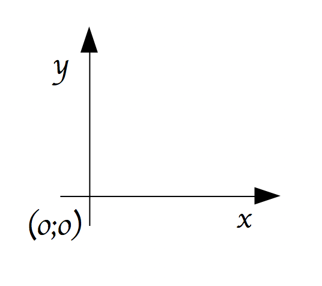
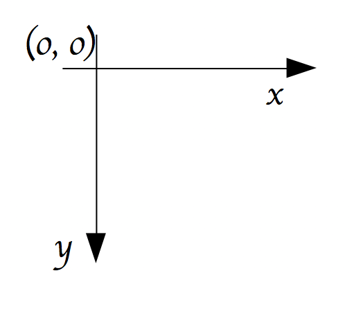

:backend: revealjs
:revealjs_theme: moon
:stem: latexmath

= Interface graphique avec Pygame
:source-highlighter: pygments
:pygments-style: tango

///////////////////////////////
//        Sources:
//
//  https://inventwithpython.com/pygame/
//
//  https://pythonprogramming.net/pygame-python-3-part-1-intro/
//
//  https://openclassrooms.com/courses/interface-graphique-pygame-pour-python/
//
///////////////////////////////

== CLI vs GUI

* CLI: Command-line interface

Ce que nous utilisions: `print()` et `input()`

* GUI: Graphical user interface

On peut interagir de façon graphique: click de souris, touches du clavier, etc.

=== CLI vs GUI ?

Contrairement à ce que l'on pourrait croire, la &laquo; majorité &raquo; des
programmes ont une CLI mais pas de GUI.

== Pygame

Pour obtenir une interface graphique, nous allons utiliser le module pygame.

Pour l'importer et l'utiliser:

[source,python]
----
import pygame
from pygame.locals import *

pygame.init()
----

=== Premier jeu

[source,python]
----
import pygame
from pygame.locals import *

pygame.init()

affi_surface = pygame.display.set_mode((800, 600))
pygame.display.set_caption("Mon premier jeu !")

while True:
  for event in pygame.event.get():
    if event.type == QUIT:
      pygame.quit()
  pygame.display.update()
----

=== !

[source,python]
----
affi_surface = pygame.display.set_mode((800, 600))
----

Permet de créer une surface dans laquelle nous allons pouvoir dessiner.
Correspond à la zone noire pour le moment.

Sa taille est de 800 pixels de large, 600 de haut.

=== !

[source,python]
----
while True:
  for event in pygame.event.get():
    if event.type == QUIT:
      pygame.quit()
  pygame.display.update()
----

Nous avons besoin d'une boucle qui demande en permanence si l'utilisateur
a fait quelque chose.

=== !

Un peu comme si le programme faisait:

[source,python]
----
Hey ? tu fais quoi ?!?
Hey ? tu fais quoi ?!?
Hey ? tu fais quoi ?!?
Hey ? tu fais quoi ?!?
Hey ? tu fais quoi ?!?
Hey ? tu fais quoi ?!?
Hey ? tu fais quoi ?!?
Hey ? tu fais quoi ?!?
Hey ? tu fais quoi ?!?
...
----

=== !

[source,python]
----
if event.type == QUIT:
  pygame.quit()
----

Ici nous réagissons à un événement, l'événement appuyer sur la croix quitter.

Nous réagissons en quittant le jeu...

=== !

[source,python]
----
pygame.display.update()
----

Affiche les modifications apportées à la fenêtre d'affichage.

== Un premier vaisseau spatial !

Nous allons essayer de créer un jeu dans lequel nous conduisons un vaisseau
spatial devant éviter différents obstacles.

=== THE vaisseau

[source,python]
----
blanc = (255,255,255)
rouge = (255,0,0)

def vaisseau(x,y):
  rect_vaisseau = pygame.Rect(x, y, 80, 40)
  pygame.draw.rect(affi_surface, rouge, rect_vaisseau)

while True:
  for event in pygame.event.get():
    if event.type == QUIT:
      pygame.quit()
  vaisseau(360,500)
  pygame.display.update()
----

=== Le vaisseau est un rectangle...

[source,python]
----
rect_vaisseau = pygame.Rect(x, y, 80, 40)
----

Nous définissons une surface rectangulaire, de 80 pixel de large et 40
pixel de haut.

Le coin haut gauche du rectangle est le point de coordonnées cartésiennes
stem:[(x;y)]

=== dessiné

[source,python]
----
pygame.draw.rect(affi_surface, rouge, rect_vaisseau)
----

Cette commande permet de dessiner notre [line-through]#vaisseau# rectangle dans
notre surface d'affichage.

=== en rouge

Pygame ne propose pas de couleurs prédéfinies.

On peut cependant définir des couleurs à partir de leur code RGB

[source,python]
----
rouge = (255,0,0)
----

=== en bas ?

[source,python]
----
vaisseau(360,500)
----

L'abscisse du coin haut gauche du [line-through]#vaisseau# rectangle est de
360 et son ordonnée 500. Avec une ordonnée de 500, il devrait en haut pas
en bas, non ?

=== Non

Les informaticiens commencent à compter à partir de 0 et mettent le bas en haut.

=== Mathématiques:

=== Informatique:

== Déplacer le vaisseau

[source,python]
----
x = 360
y = 550
while True:
  for event in pygame.event.get():
    if event.type == QUIT:
      pygame.quit()
  y_change = -5
  y = y + y_change
  vaisseau(x,y)
  pygame.display.update()
----

=== Le vaisseau ne se déplace pas ?

[%step]
* Rien ne se déplace jamais dans un écran
* Les personnages de jeux video ne se déplacent pas !
* Il n'y a que des pixels qui changent de couleur

=== La solution:

image::https://media.giphy.com/media/S60BAGcMCRHzy/giphy.gif[]

=== En pratique:

* On peint tout en blanc
* On dessine un rectangle rouge
* On affiche le tout
* On repeint tout en blanc, l'ancien rectangle rouge a disparu
* On dessine un rectangle rouge quelques pixels au dessus du précédent
* On affiche le tout
* ....

=== !

[source,python]
----
x = 360
y = 550
while True:
  for event in pygame.event.get():
    if event.type == QUIT:
      pygame.quit()
  y_change = -5
  y = y + y_change
  affi_surface.fill(blanc)
  vaisseau(x,y)
  pygame.display.update()
----

== FPS

FPS: Frames per second, nombre d'images par seconde

=== !

Un jeu est donc une suite d'image à l'écran.

Comme notre vaisseau se déplace à chaque image, le nombre d'image par
seconde influe sur la &laquo; vitesse &raquo; de notre vaisseau.

=== !

[source,python]
----
fps = 30
fps_clock = pygame.time.Clock()
x = 360
y = 550
while True:
  for event in pygame.event.get():
    if event.type == QUIT:
      pygame.quit()
  y_change = -5
  y = y + y_change
  affi_surface.fill(blanc)
  vaisseau(x,y)
  pygame.display.update()
  fps_clock.tick(fps)
----

=== !

Attention, pour chaque affichage d'image, des calculs sont effectués, ces
calculs prennent du temps, et s'ils prennent trop de temps, il n'est pas
possible d'obtenir le FPS voulu.

== Piloter le vaisseau

Au clavier !

=== !

[source,python]
----
x, y = 360, 550
x_change, y_change = 0, 0
while True:
  for event in pygame.event.get():
    if event.type == QUIT:
      pygame.quit()
    if event.type == pygame.KEYDOWN:
      if event.key == pygame.K_LEFT:
        x_change = -5
  affi_surface.fill(blanc)
  x, y = x + x_change, y + y_change
  vaisseau(x,y)
  pygame.display.update()
  fps_clock.tick(fps)
----

=== Observez bien, quel est le problème ?

=== La solution

[source,python]
----
if event.type == pygame.KEYUP:
  if event.key == pygame.K_LEFT or event.key == pygame.K_RIGHT:
    x_change = 0
----
