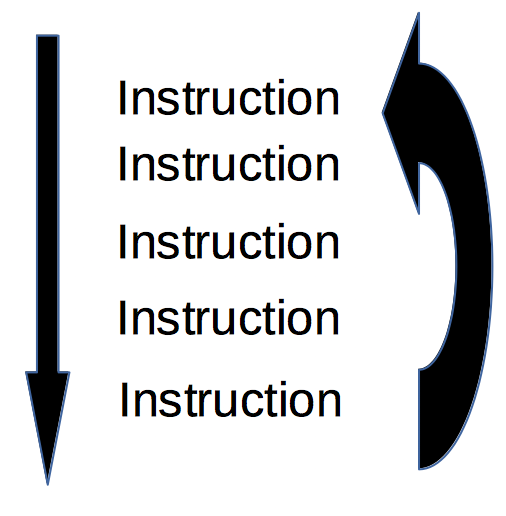
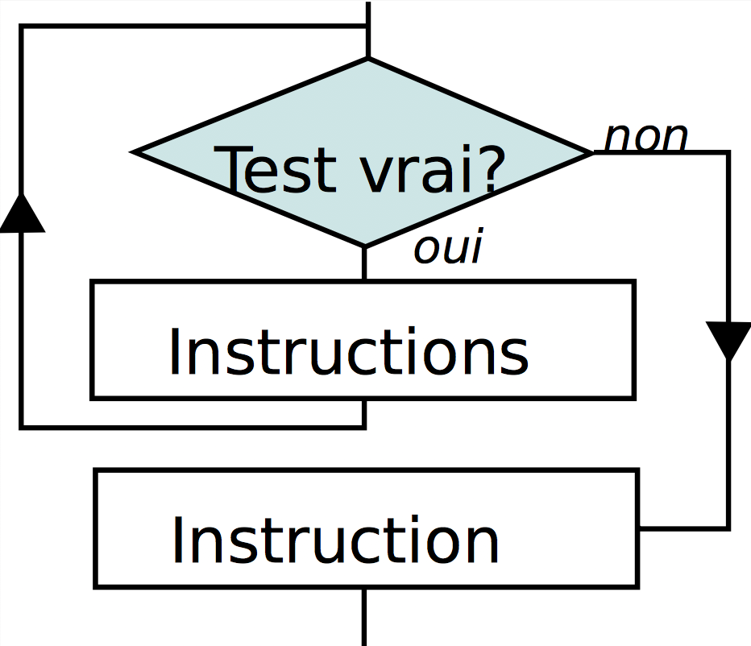

:backend: revealjs
:revealjs_theme: moon

= La boucle tant que...
:source-highlighter: pygments
:pygments-style: tango

// Cours sur le tant que
// Donnée le 20/10

== Qu'est ce qu'une boucle ?

Une boucle est une structure qui permet de répéter les mêmes instructions
 plusieurs fois.

== !

== !

. la machine exécute les instructions de bas en haut comme d'habitude
. une fois arrivé à la fin de la boucle, on repart à la première instruction
. les instructions sont à nouveau exécuter de bas en haut
. une fois arrivé à la fin de la boucle, on recommence...

== !

Mais il faut bien finir par s'arrêter..

C'est pour cela que quand on crée une boucle, on indique toujours une condition.

Cette condition signifiera « Répète la boucle tant que cette condition est vraie ».

== !

== Syntaxe du while en Python

[source,python]
----
while condition:
    bloc..........................
    ..............................
    d instructions ...............
----

== Les conditions

Les conditions sont les mêmes que pour le `if`.

== Un exemple

[source,python]
----
nombre = 0
while nombre != "42":
  nombre = input("Entrez le nombre 42.")
----

== Un autre

[source,python]
----
i = 0
while i < 10:
    print("Bonjour !")
----

Combien de fois Bonjour ! est-il affiché ?

== !

[source,python]
----
i = 0
while i < 10:
    print("Bonjour !")
    i = i + 1
----

Combien de fois Bonjour ! est-il affiché ?

== Attention au boucle infini

Il faut vérifier que notre boucle s'arrête !

== Que fait ce programme ?

[source,python]
----
i = 0
while i <= 100:
    print(i)
    i = i + 1
----

== Que fait ce programme ?

[source,python]
----
i = 0
a = 0
while i <= 100:
    a = a + i
    i = i + 1
print(a)
----

== Utilisation d’un module

== !

`import` permet d'accéder à des fonctions, variables... déjà codé. +
L’importation d’un module peut se faire de deux manières.

== Méthode 1:

On désigne le module à importer par son nom, il faut préfixer par son nom à chaque fois:

[source,python]
----
import math
x = math.sqrt(4) #sqrt permet de calculer la racine carrée
y = math.cos(0)
print(x,y)
----

== Méthode 2:

`from import` permet d'importer des fonctionnalités précises
Dans le cas d’un import de plusieurs fonctionnalités,les noms sont séparés par des virgules.

[source,python]
----
from math import sin, cos
x = sin(0)
print(x)
----

== !

Enfin, il est possible d’importer, avec cette seconde approche,
tous les éléments d’un module en utilisant la notation *

[source,python]
----
from turtle import *
----

Attention, avec cette dernière forme car il peut il y avoir conflits entre les
noms.
