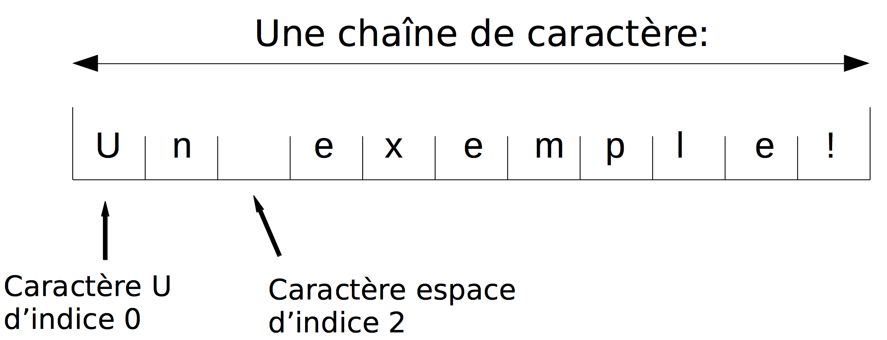

:backend: revealjs
:revealjs_theme: moon

= Manipulation des chaînes de caractères.
:source-highlighter: pygments
:pygments-style: tango

== Les caractères

Une lettre est un caractère, mais tout les caractères ne sont pas des lettres !

=== Quelques exemples de caractères

@ # & , ! . * % " sont des caractères

=== Les chiffres sont des caractères

En Python, on distingue le nombre de 2, du symbole le représentant à l'aide
de guillemet, "2".

=== Différence entre minuscule et majuscule:

Attention a et A sont deux caractères différents !

=== Des caractères particuliers:

Le caractère " " est le caractère espace.

Le caractère `"\n"` est le caractère saut à la ligne.

Certains smileys/emoticons sont des caractères.

== Les chaînes de caractères

Une chaîne de caractères est une suite de caractères.

Un mot ou une phrase sont des chaînes de caractères.

=== !

En Python, les chaînes de caractères sont notées avec des guillemets:

[source,python]
----
"Je suis une chaîne !"
----

=== !

On peut stocker une chaîne de caractère dans une variable:

[source,python]
----
chaine = "Un exemple!"
----

=== !

Chaque caractère dans une chaîne posséde un indice:

=== !

On peut accéder à un caractère d'une chaîne en se référant à son indice:

[source,python]
----
>>> chaine = "Un exemple!"
>>> chaine[0]
 "U"
>>> chaine[3]
 "e"
----

=== !

La fonction `len` renvoie la longueur d'une chaîne:

[source,python]
----
chaine = "Un exemple!"
len(chaine) #Combien vaut len(chaine)
----

=== !

[source,python]
----
>>> chaine = "Un exemple!"
>>> len(chaine)
  11
----

=== !

[source,python]
----
chaine = "Un exemple!"
----

Quel est l'indice de ! ?

=== !

C'est 10, l'indice du dernier caractère est toujours `len(chaine)-1`

== Quelques exemples

[source,python]
----
phrase = input()
if phrase[len(phrase)-1] == ",":
  print("Attention à votre ponctuation")
----

Que fait ce programme ?

=== !

[source,python]
----
phrase = input()
presente = False
for i in range(len(phrase)):
  if phrase[i] == "a":
    present = True

print(presente)
----

Que fait ce programme ?

// == Modifier une chaîne de caractère ?
//
// === !
//
// On ne peut pas modifier une chaîne de caractère.
//
// === !
//
// On peut cependant en recréer une à l'aide de la concaténation.
//
// === Concaténation
//
// Concaténer veut dire mettre bout à bout.
//
// La concaténation de "ba" et de "bar" est "babar"
//
// === En python
//
// En python la concaténation se fait avec le `+`
//
// [source,python]
// ----
// >>> "bon"+"jour"
//  "bonjour"
// ----
//
// === !
//
// [source,python]
// ----
// chaine = "un exemple"
// nouvelle_chaine = "" #crée une chaine vide
// for i in range(len(chaine)):
//   nouvelle_chaine = nouvelle_chaine + chaine[i] + "@"
//
// print(nouvelle_chaine)
// ----
//
// Que fait ce programme ?
