:backend: revealjs
:revealjs_theme: solarized

= Les langages du web.
:source-highlighter: pygments
:pygments-style: tango

== De quoi a-t-on besoin pour réaliser une page web ?

* Un navigateur web
* Un éditeur de texte

=== En pratique:

* L'éditeur de texte que nous utiliserons est Spyder, inclu dans Anaconda

=== Pour créer une page web:

* Créer un dossier (pour organiser ses documents)
* Dans ce dossier créer un fichier `.html`
* Toujours dans ce dossier créer un fichier `style.css`

== De quoi est fait une page web ?

=== !

image:assets/html5-logo.png[html,300,300,float="left",align="center"]
image:assets/css3-logo.png[css3,300,300,align="center"]
image:assets/js-logo.png[javascript,300,300,float="right",align="center"]

=== Le contenu et sa structure

image:assets/html5-logo.png[html,350,350,align="center"]

C'est le fond et des étiquettes.

=== L'apparence

image:assets/css3-logo.png[css3,350,350,align="center"]

C'est la forme.

=== Pour rendre la page dynamique

image:assets/js-logo.png[javascript,350,350,align="center"]

C'est un langage de programmation.

== HTML

C'est un langage de balisage.

Les balises ou tag permettent d'identifier et de structurer le contenu.

=== Le squelette d'un fichier HTML

_Attention incomplet_

[source,html]
----
<!DOCTYPE html>
<html>

  <!-- Le code HTML se trouvera ici -->

</html>
<!-- end of file -->
----

=== Le squelette d'un fichier HTML

[source,html]
----
<!DOCTYPE html>
<html>
  <head>

    <!-- Pour simplifier: les meta-données -->

  </head>
  <body>

    <!-- Pour simplifier: le contenu affiché -->

  </body>
</html>
<!-- end of file -->
----

=== Le squelette d'un fichier HTML

[source,html]
----
<!DOCTYPE html>
<html>
  <head>
    <title>Hello world</title>
    <meta charset="utf-8">
  </head>
  <body>

    <!-- Pour simplifier: le contenu affiché -->

  </body>
</html>
<!-- end of file -->
----

=== La syntaxe d'un élément HTML:

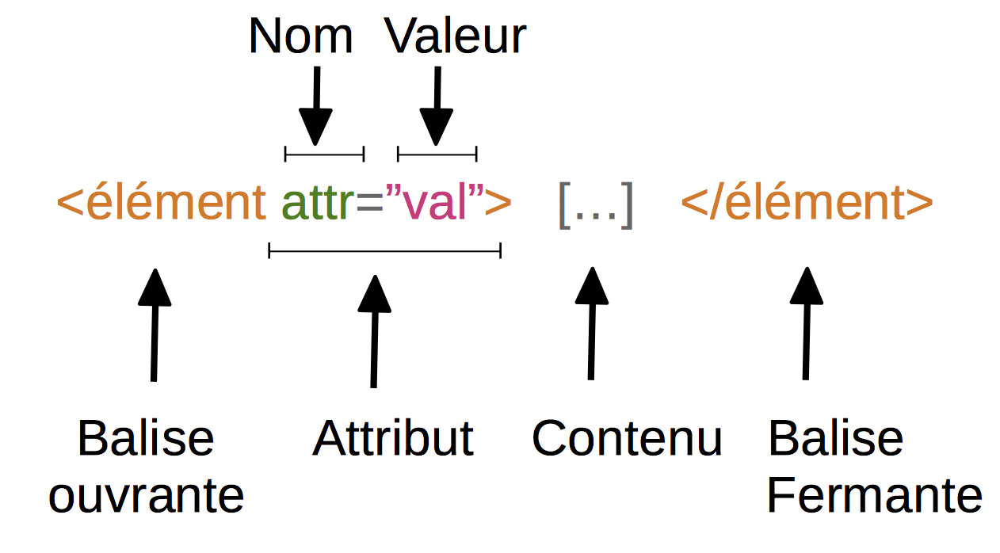

=== Exemple:

[source,html]
----
<a href="http://lapiecode.info/" target="_blank">
  Le site de l'ISN
</a>
----

Résultat: link:http://lapiecode.info/[Le site de l'ISN]

Test:

* Quel est le nom de l'élément ?
* Citer le nom d'un attribut ? Sa valeur ?
* Quel est le contenu de l'élément ?

=== Quelques éléments HTML:

* Les titres
* Les paragraphes
* Les listes
* Les images
* Les liens

=== Les titres

[source,html]
----
<h1>[...]</h1>  <!-- Titre principal -->
<h2>[...]</h2>  <!-- Sous-titre -->
<h3>[...]</h3>  <!-- Sous-sous-titre -->
<h4>[...]</h4>  <!-- Etc.. -->
<h5>[...]</h5>
<h6>[...]</h6>
----

=== Les paragraphes

[source,html]
----

  Lorem ipsum dolor sit amet, consectetur adipisicing elit.
  Veritatis laboriosam mollitia autem at ab omnis iure quis
  asperiores inventore eos nam aut iusto officiis deserunt
  nihil, sequi tempore impedit quae?

----

=== Les paragraphes

[source,html]
----

  On peut <em>insister</em> plus particulièrement sur une
  partie du texte. On peut <strong>encore plus insister</strong>.

----

=== Les listes:

[source,html]
----
<h1>Guacamole rapide à faire</h1>

<h2>Ingrédients</h2>
<ul>
  <li>2 avocats (pelés et avec les noyaux retirés)</li>
  <li>le jus d'un citron</li>
  <li>1 petite tomate, coupée</li>
</ul>

<h2>Instructions</h2>
<ol>
  <li>Écrasez délicatement les avocats avec une fourchette</li>
  <li>Placez la purée obtenue dans un plat et arrosez avec le jus de citron</li>
  <li>Mélangez avec la tomate </li>
  <li>Gardez au frais et servir rapidement avec des tortillas</li>
</ol>
----

Elles peuvent être ordonnées `ol` ou non ordonnées `ul`.

=== Images

[source,html]
----

----

=== Les liens

[source,html]
----
<a href="https://developer.mozilla.org/fr/">
Une très bonne référence pour le HTML et le CSS.
</a>
----

=== A votre tour(1):

[source,html]
----
<meta charset="utf-8">
<title>Ma start-up</title>
----
[source,html]
----
<h1>Notre super app</h1>

 Est un prétexte pour faire du HTML..

<a href="#"> Rejoignez-nous <a>

<h2>Rapide</h2>

Vraiment super <strong>rapide</strong>.

<h2>Simple</h2>

Facile d'accès

La super application de notre super start-up

----

=== A votre tour(2):

Pour illustrer les propriétés de votre application, utiliser des icônes PNG:

image:assets/diamond.png[diamant,100,100]
image:assets/briefcase.png[valise,100,100]
image:assets/heart.png[coeur,100,100]
image:assets/laptop.png[ordi,100,100]

== CSS

Cascading Style Sheets

=== Le web sans CSS

Aller sur
link:http://www.csszengarden.com/[www.csszengarden.com]
clic droit: examiner élément. +
Et lui "enlever la tête".

=== Lier une feuille de style

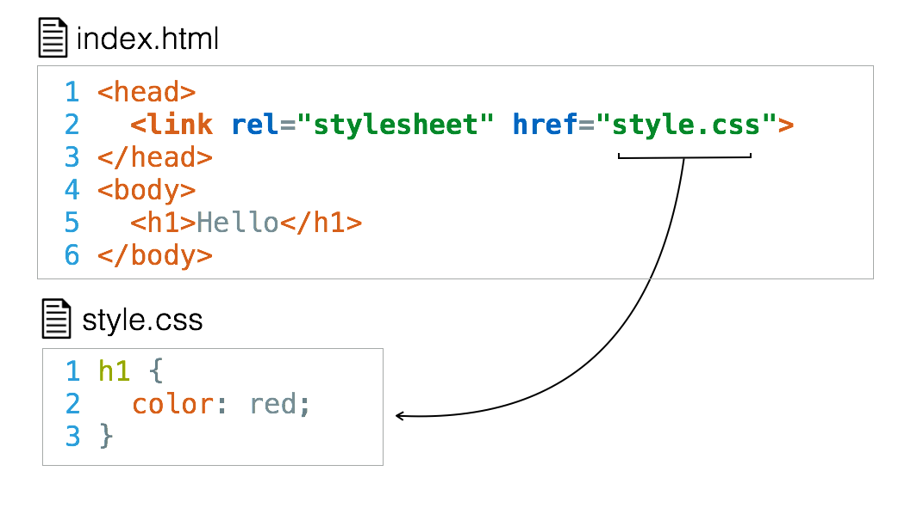

=== La syntaxe CSS

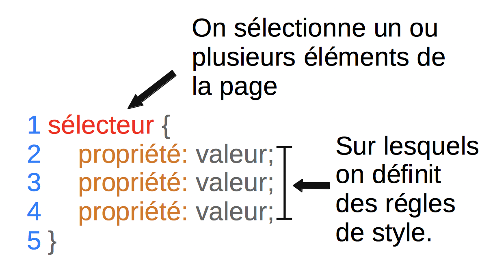

=== Exemple:

[source,css]
----
h2 {
  color: red;
  font-size: 20px;
  font-family: courier;
}
----

=== Couleur(1)

[source,css]
----
body {
  color: orange;
}
----

=== Couleur(2)

[source,css]
----
body {
  color: #FFA500;
}
----

=== Couleur(3)

[source,css]
----
body {
  color: rgb(145, 110, 30);
}
----

=== Couleur(4)

[source,css]
----
body {
  color: rgba(145, 110, 30, 0.8);
}
----

RGBA ajoute un quatrième paramètre l'opacité.

=== Texte et arrière plan:

[source,css]
----
body {
  color: orange; /* couleur du texte */
  background-color: yellow; /* couleur du fond */
}
----

=== Fonts - family (1)
image:assets/serif.png[]

=== Fonts - family (2)

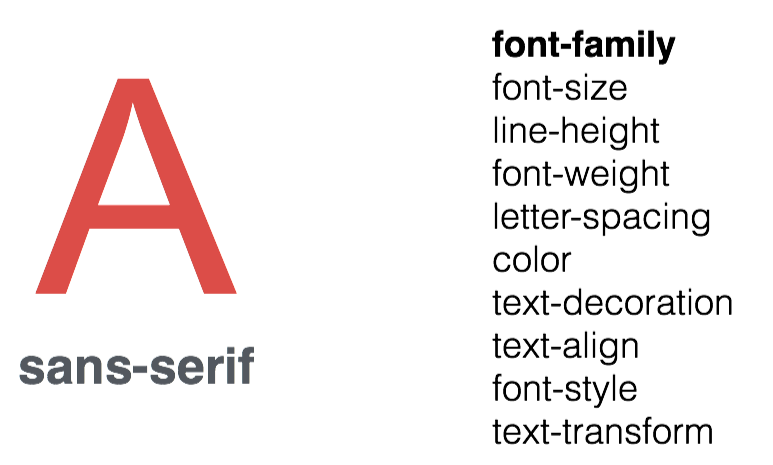

=== Fonts - family (3)

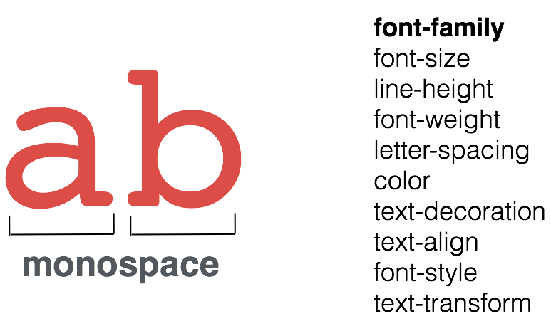

=== Fonts - size and spacing

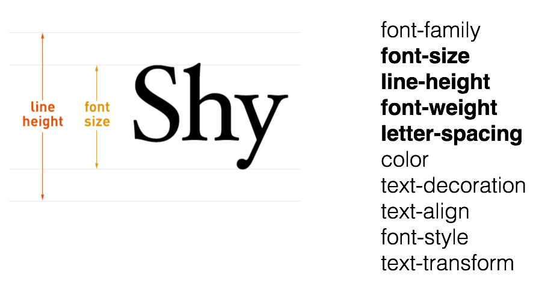

=== Fonts - colors

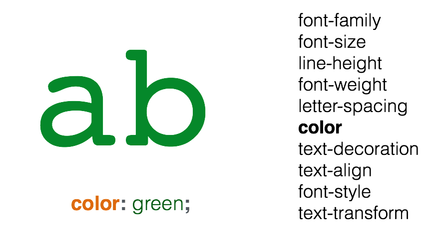

=== Fonts - decoration

image:assets/text-decoration.png[]

=== Fonts - alignment

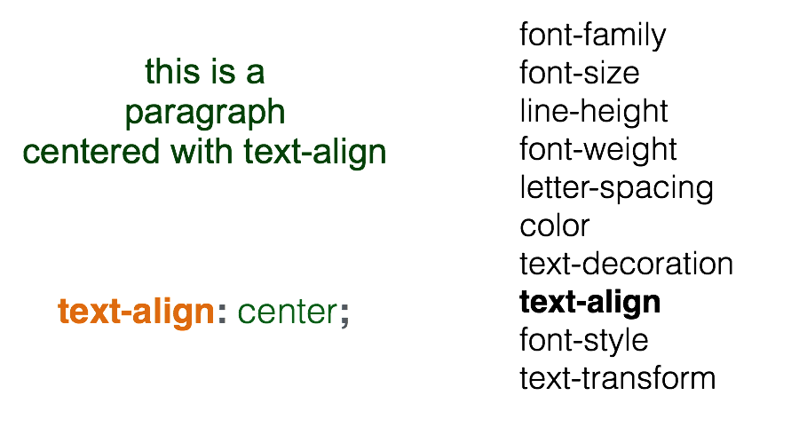

=== A votre tour(1)

head

[source,html]
----
<link href='style.css' rel='stylesheet'>
----

style.css

[source,css]
----
body {
  margin: 0px;
  color: green;
  background: rgb(245,245,245);
}
h1 {
  font-family: courier;
  color: rgb(212,57,43);
}
p {
  font-size: 30px;
  line-height: 20px;
}
----

=== A votre tour(2)

Copier/coller le code précédent et le modifier pour que:

* La couleur du texte dans <body> soit noir "cassé".
* La taille du texte des paragraphes soit mieux adapté.
* La couleur des titres <h1> soit plus adapté.
On pourra utiliser:
link:https://developer.mozilla.org/en-US/docs/Web/CSS/CSS_Colors/Color_picker_tool[Le site de mozilla.]

Ou link:https://coolors.co[https://coolors.co]

On peut aussi utiliser l'extension ColorZilla pour reconnaitre les couleurs sur le web.

=== A votre tour(3)

Utiliser le site link:https://www.google.com/fonts[https://www.google.com/fonts]
dans votre `<head>`, pour:

* Utiliser la police de votre choix pour `<h1>`
* La police `Open-Sans` dans tout le reste du `<body>`
* Vous pouvez identifier les polices avec l'extension link:http://fontface.ninja/[http://fontface.ninja/]

== Structurer une page

Si on va sur _n'importe quelle page web_ et qu'on examine son code, on
voit des balises `
` partout.

=== Box model (1)

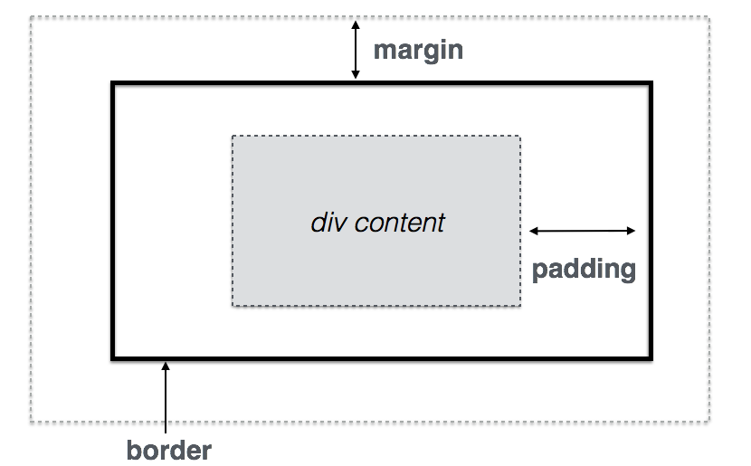

=== Box model (2)

image:assets/box-model-detailed.png[]

=== Syntaxe et raccourcis

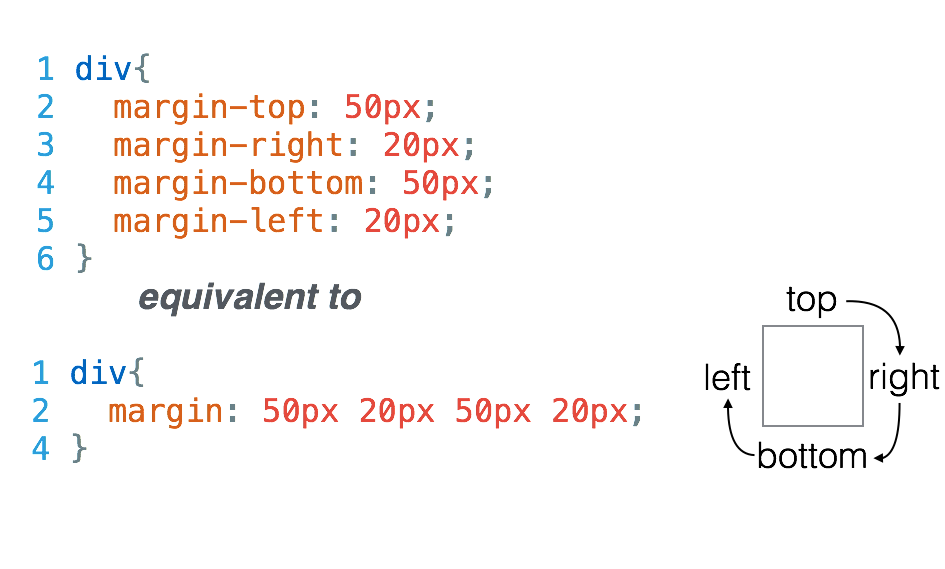

=== Les bordures

[source,css]
----
div {
  border-top: 1px solid red;
  border-right: 2px dotted black;
  border-bottom: 1px dashed green;
  border-left: 2px dotted black;
}
----

[source,css]
----
div {
  border: 1px solid black;
}
----

=== A votre tour(1)

Structurez votre HTML avec la balise `
`
[source,html]
----
<body>
  

    <h1>Notre super app</h1>
    
 Est un prétexte pour faire du HTML..

  

  

    <h2>Rapide</h2>
    
Vraiment super <strong>rapide</strong>.

    
  

  <!-- ... -->
  

    
La super application de notre super start-up

  

</body>
----

== Nommer ses balises

=== Comment cibler un élément ?

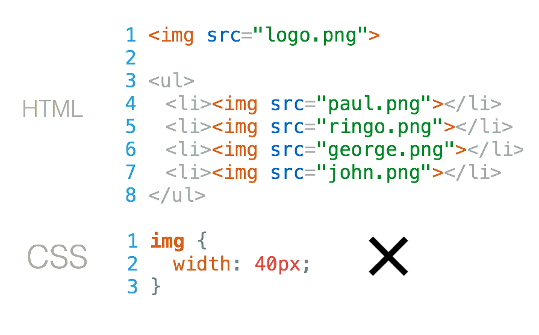

=== Nommer une balise avec `id`

image:assets/id-solution.png[]

=== Comment cibler plusieurs éléments ?

image:assets/class-dilemma.png[]

=== Nommer une balise avec `class`

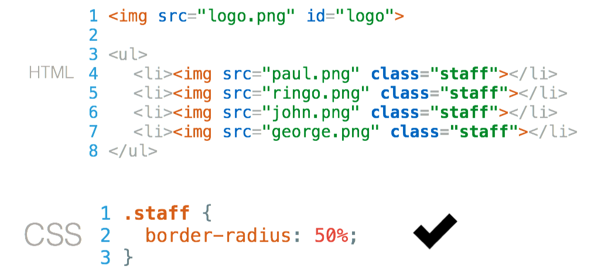

=== `id` ou `class`?

image:assets/class-or-id.png[]

=== combiner (1)

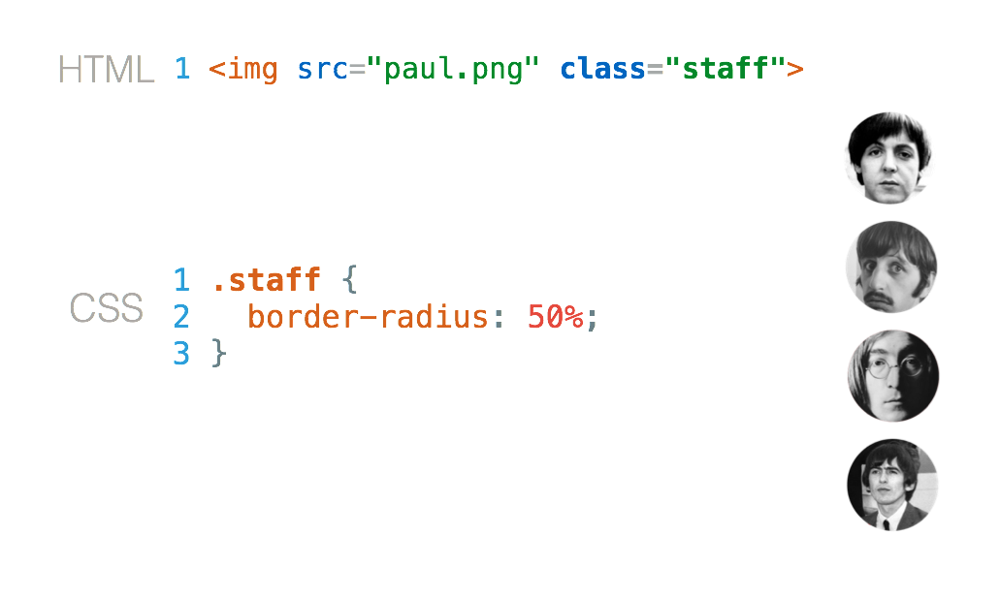

=== combiner (2)

image:assets/combine-class-2.png[]

=== combiner (3)

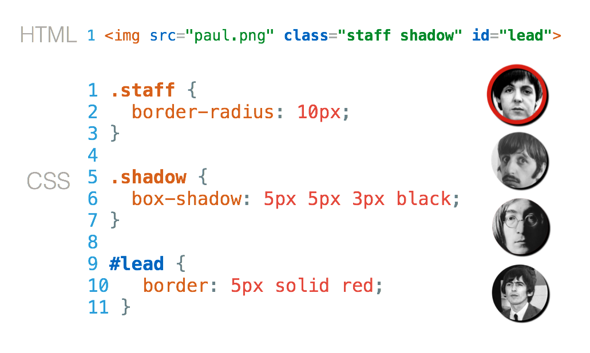

=== A votre tour (1)

Nommez vos balises:

[source,html]
----
<body>
  

    <h1>Notre super app</h1>
    
 Est un prétexte pour faire du HTML..

  

  

    <h2>Rapide</h2>
    
Vraiment super <strong>rapide</strong>.

    
  

  <!-- ... -->
  

    
La super application de notre super start-up

  

</body>
----

=== A votre tour (2)

Stylisez:

[source,css]
----
#mon_header{
  text-align: center;
  background-image: url("https://picsum.photos/1000/800/?random");
  background-size: cover;
  padding: 150px;
  color: white;
  text-shadow: 1px 1px 5px black;
}

.feature{
  padding: 50px;
  font-weight: 300px;
}

.feature img{
  padding: 20px;
  border: 2px solid black;
  border-radius: 50%;
}

#mon_footer{
  padding: 30px;
  background: rgb(30, 30, 30);
  color: lightgrey;
}
----
== Un peu de mise en page..

=== Block - Inline

En général, les éléments HTML sont de type: block ou inline.

=== Block

* Des éléments de type Block: h1, p, ul, ...
* Ils prennent toutes la largeur, sauf si leur largeur est précisée.
* Saut de ligne avant et après.

=== Block

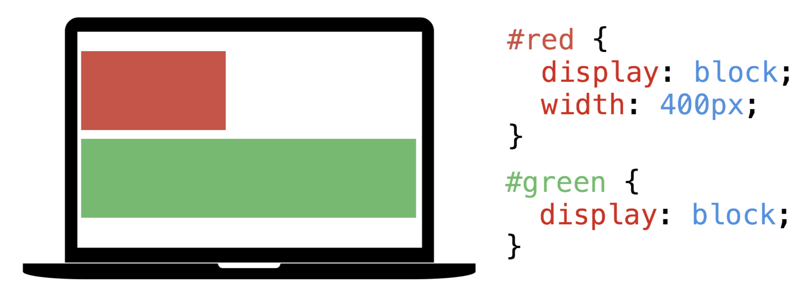

=== Inline

* Des éléments de type inline: strong, em, a, img, ...
* Ils prennent la largeur de leur contenu.
* Pas de saut de ligne.

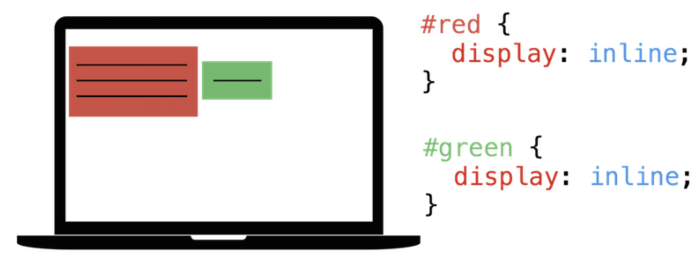

=== float

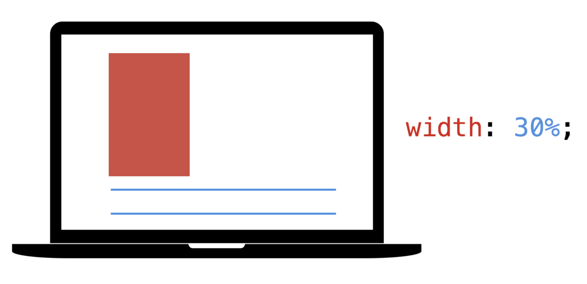

=== float

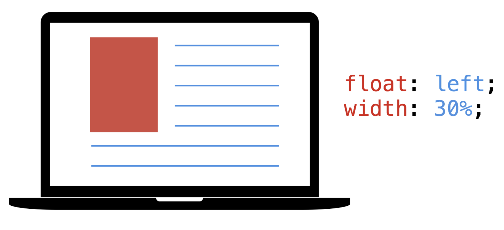

== Validation W3C

A la différence d'un programme en Python, une page Web peut contenir des
erreurs de syntaxe et "fonctionner".

=== !

Pour vérifier que votre page Web est conforme aux spécifications HTML5, rendez-vous sur le site du W3C (World Wide Web Consortium) :
link:http://validator.w3.org[http://validator.w3.org]

Les éventuelles erreurs vous seront signalées avec des explications (en anglais.)

Vous pouvez de même valider votre css ici: link:https://jigsaw.w3.org/css-validator/#validate_by_upload[https://jigsaw.w3.org/css-validator/]

== Pour aller plus loin..

=== Un site comprenant plusieurs pages:

Il suffit tout simplement de faire plusieurs pages, avec plusieurs fichiers
`.html` et de mettre des liens entre ces pages.

L'attribut `href` de la balise `<a>`, peut prendre comme valeur le chemin
d'un fichier.

Par exemple, si deux pages se trouvent dans le même dossier:

[source,html]
----
<a href="page2.html"> Un lien vers la page 2. <a>
----

Ces pages peuvent utiliser le même fichier `css`.

=== !

Ce cours n'est qu'une très brève introduction au `html` et au `css`.

Pour en apprendre plus sur le sujet vous pouvez consulter
link:https://openclassrooms.com/courses/apprenez-a-creer-votre-site-web-avec-html5-et-css3[le site Openclassrooms].

=== Flexbox

Pour réaliser des mises en page plus complexes, il peut être intéressant de découvrir la propriété `css`: `flexbox`:

link:https://openclassrooms.com/courses/apprenez-a-creer-votre-site-web-avec-html5-et-css3/la-mise-en-page-avec-flexbox[La partie sur flexbox d'Openclassrooms.]

=== Réaliser une barre de navigation:

Une barre de navigation est une liste de lien que l'on va styliser.

On peut pour cela utiliser la propriété `flexbox`.
