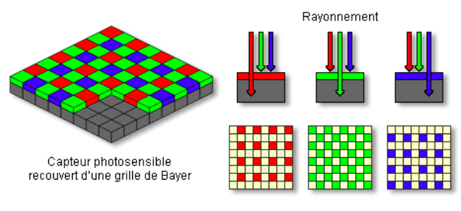

:backend: revealjs
:revealjs_theme: moon
:stem: latexmath
:source-highlighter: pygments
:pygments-style: tango

= De la photographie à l'image

== Ce que nous avons vu

* Une image numérique matricielle est un tableau de triplet de nombres.
* Ces nombres sont entre 0 et 255
* Ils correspondent au rouge, au vert et au bleu. (RGB)

=== RGB

https://www.w3schools.com/colors/colors_rgb.asp

=== Ce que nous avons vu

* La définition d'un écran est son nombre de pixel.
* Sa résolution est son nombre de pixel par pouce (inch).

== Principe de l'appareil photographique numérique

== Capteur photo

=== !

video::http://portail.lyc-la-martiniere-diderot.ac-lyon.fr/srv20/html/imageHTML/videos/sorcier2.mp4[]

=== !

video::http://portail.lyc-la-martiniere-diderot.ac-lyon.fr/srv20/html/imageHTML/videos/sorcier3.mp4[]

=== !

* Le capteur photo est composé d'un grand nombre de photosites.
* Chaque photosite est une cellule photoélectrique qui transforme une intensité lumineuse en signal électrique.
* La tension électrique produite par un photosite est « convertie » en nombre.

=== !

Attention la vidéo par de pixel pour les photosites.

=== !

video::http://portail.lyc-la-martiniere-diderot.ac-lyon.fr/srv20/html/imageHTML/videos/sorcier4.mp4[]

=== Vers la couleur

* Chaque photosite possède un filtre.
* Filtres rouges qui laisseront uniquement passer la lumière rouge, ou vert ou bleu.

=== !

image::https://interstices.info/wp-content/uploads/2020/05/output.gif[alt]

=== Matrice de Bayer

Les filtres de la matrice de Bayer sont constitués:

* 50% de filtres vert
* 25% de filtre rouge
* 25% de filtre bleu

Car notre oeil est plus sensible au vert qu'au bleu et au rouge.

=== Fichier RAW

Les nombres obtenus grace au capteur photo sont stockés dans un fichier RAW.

=== Des photosites aux pixels

* Chaque photosite correspond à une seule couleur ?
* Comment obtenir un pixel (trois couleurs) depuis un photosite ?

=== Dématriçage

* Le fait d'obtenir un pixel à partir des valeurs données par les photosites.
* C'est un traitement algorithmique.
* Il existe différente façon de faire, cela joue sur la qualité finale de l'image.

=== Plusieurs photosites pour un pixel

Dans ce cas, il faut prendre plusieurs photosites pour un pixel: bof.

=== Dématriçage par copie de pixels

Consiste à prendre la couleur du voisin le plus proche.

=== Dématriçage par Interpolation bilinéaire

On fait la moyenne des couleurs des voisins.

=== Dématriçage

* Il existe d'autres moyens plus ou moins complexes de le faire.
* Il est possible par interpolation d'avoir plus de pixel que de photosite.

=== Image avant dématriçage

image::https://interstices.info/wp-content/uploads/2020/05/0raw.png[]

=== Image après dématriçage

image::https://interstices.info/wp-content/uploads/2020/05/1demo.png[alt]

=== Les opérations classiques sur l'image

link:https://interstices.info/tout-ce-que-les-algorithmes-de-traitement-dimages-font-pour-nous/#4[Les étapes pour l'image du chien]

=== Correction optique: exemple du fisheye

