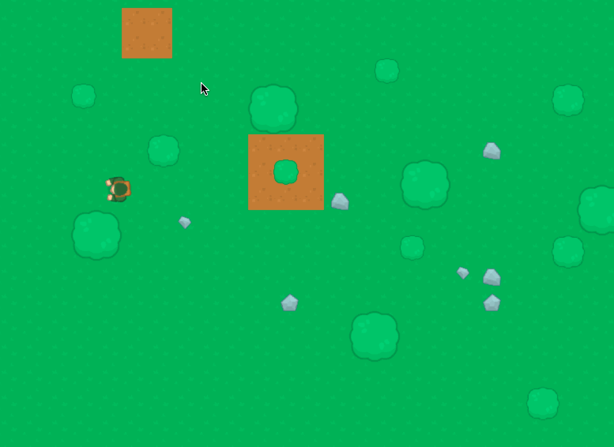
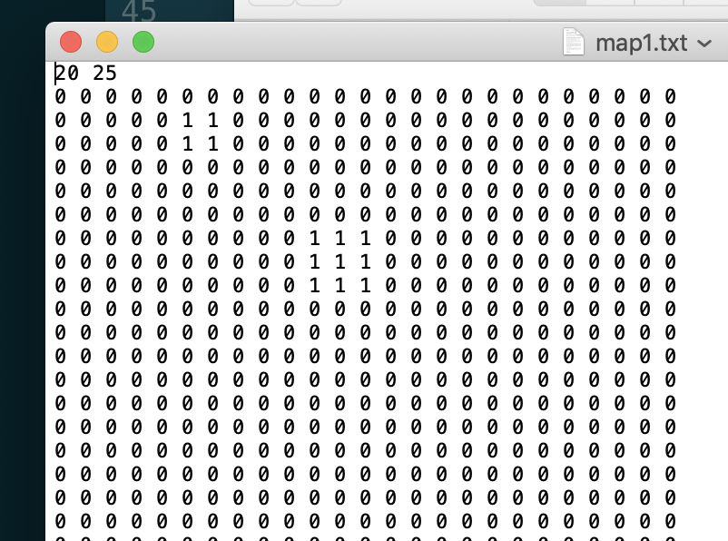
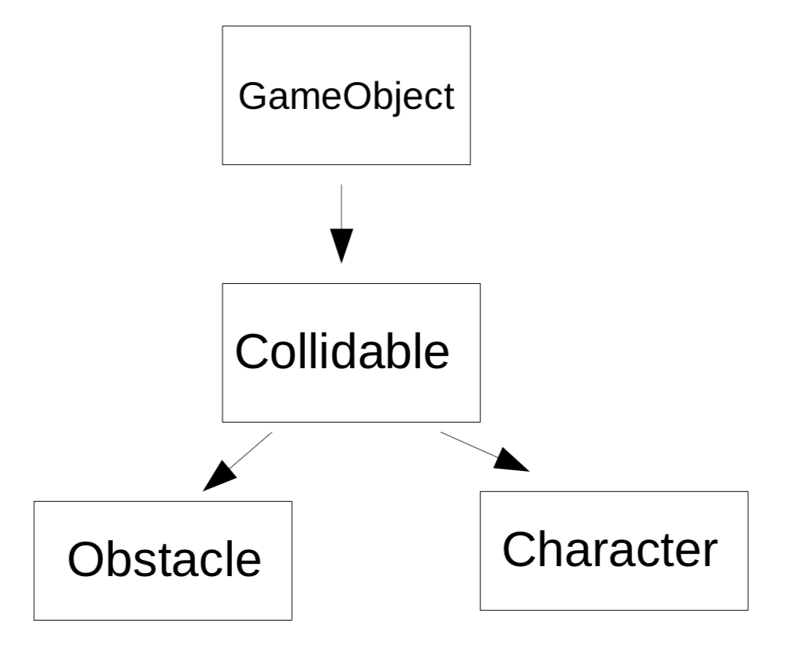

:backend: revealjs
:revealjs_theme: moon
:stem: latexmath

= Presentation Bataille en Forêt
:source-highlighter: pygments
:pygments-style: tango

== Technologie utilisée

* C++
* SDL

== Présentation du jeu

=== Déplacement sur une carte

=== !

Utilisation des fléches pour tourner, avancer, reculer.

Gestion des collisions.

=== !

== Organisation du code

== Le fichier principal

[source,c++]
----
game = new Game();
game->init("First test", SDL_WINDOWPOS_CENTERED, SDL_WINDOWPOS_CENTERED, 800, 640, false);

while (game->running()) {

    frameStart = SDL_GetTicks();

    game->handleEvents();
    game->update();
    game->render();
----

=== La gestion des FPS

[source,c++]
----
frameTime = SDL_GetTicks() - frameStart;
if (csts::frameDelay > frameTime) {
    SDL_Delay(csts::frameDelay - frameTime);
----

== Les principaux éléments

[%step]
* Une classe Game organisant le jeu
* Une classe Map
* Une classe Player
* Une liste d'objets de la classe Obstacle

=== !

Tout les objets s'affichant dérive de la classe GameObject

== La carte/classe Map

=== !

Elle est configuré depuis un fichier .txt

=== !

Elle est organisée en deux couches:

* les sols
* les obstacles

=== Les sols

Les sols sont stockés dans un tableau dynamique:

[source,cpp]
----
backGroundMap = new int*[mapWidth];
for(int i = 0; i < mapWidth; ++i)
    backGroundMap[i] = new int[mapHeight];

// loading the background
for (int row = 0; row < mapWidth; row++) {
    for (int column = 0; column < mapHeight; column++) {
        mapFile >> strInput;
        backGroundMap[row][column] = std::stoi(strInput);
    }
}
----

=== !

[source,cpp]
----
Map::~Map() {
    for(int i = 0; i < mapWidth; ++i) {
        delete [] backGroundMap[i];
    }
    delete [] backGroundMap;
}
----

=== Les sols

Ce sont des GameObjects, ils ont:

* Une position
* Une texture
* Une dimension

=== Les obstacles

Le fichier stockant la carte permet de les créer:

[source,cpp]
----
int otype;
for (int row = 0; row < mapWidth; row++) {
    for (int column = 0; column < mapHeight; column++) {
        mapFile >> strInput;
        otype = std::stoi(strInput);
        if (otype) {
            otype--;
            Obstacle::obstacleBuilder(column * csts::TILESIZE, row * csts::TILESIZE, static_cast<ObstacleType>(otype));
----

=== Liste d'obstacles

Lors de la création ils sont ajoutés dans une liste.

(via la structure de donnée <set> de la bibliothèque standard)

== La classe GameObject

=== Leur structure

[source, cpp]
----
int xpos;  // Position
int ypos;

SDL_Texture* objTexture;  // Texture
SDL_Rect srcRect, destRect; // "Dimensions"
----

=== Les méthodes

[source, cpp]
----
void update();
void render();
----

=== !

Ce n'est pas une classe virtuelle, les sols sont des GameObjects

=== !

=== !

On peut imaginer une classe movable héritant de collidable dont hériterait
une classe bullet et la classe character

=== La classe Collidables

* Les objets pouvant entrer en collision
* Tout sauf les « sols ».
* Ils possédent un niveau de resistance et peuvent être détruit (non implémenté).

=== La classe Character

La classe de répresentation des joueurs

=== Elle permet les déplacements

[source,cpp]
----
void Character::rotate() {
    orientation += rotation;
    if (orientation > 360) {
        orientation /= 360;
    }
    if (orientation < 0) {
        orientation += 360;
    }
}

void Character::move() {
    xpos += Vector2D::getOrientationVector(orientation).x * velocity * speed;
    ypos += Vector2D::getOrientationVector(orientation).y * velocity * speed;
    destRect.x = xpos;
    destRect.y = ypos;
}

void Character::update() {
    rotate();
    move();
}
----

=== La classe Obstacle

Cette classe hérite donc de la classe collidables et va se distinguer par la présence d’une hauteur.

La hauteur n'est pas visibble mais permet de déterminer la résistance des Obstacles.

=== !

Pas de sous-classe arbre ou objet. Le sous-type est précisé à la création:

[source,cpp]
----
enum class ObstacleType {
    TREE,
    SMALLTREE,
    BIGTREE,
    ROCK,
    SMALLROCK,
    OTHERROCK
};
----

=== !

[source,cpp]
----
void Obstacle::obstacleBuilder(int x, int y, ObstacleType obsType) {
    Obstacle* newobstacle = nullptr;
    int h = 0;
    int d = 0;
    switch (obsType) {
        case ObstacleType::TREE:
        case ObstacleType::OTHERROCK:
        case ObstacleType::ROCK: {
            d = csts::OBSTACLESIZE / 1.5;
            h = csts::OBSTACLEHEIGHT;
            break;
        }
        case ObstacleType::BIGTREE: {
            d = csts::OBSTACLESIZE;
            h = csts::OBSTACLEHEIGHT * 2;
            break;
        }
        case ObstacleType::SMALLTREE:
        case ObstacleType::SMALLROCK: {
            d = csts::OBSTACLESIZE / 2;
            h = csts::OBSTACLEHEIGHT / 2;
            break;
        }
        default:
            break;
    }

    switch (obsType) {
        case ObstacleType::SMALLTREE:
        case ObstacleType::TREE:
        case ObstacleType::BIGTREE: {
            newobstacle = new Obstacle("assets/tile_183.png", x, y, h, d);
            break;
        }
        case ObstacleType::ROCK: {
            newobstacle = new Obstacle("assets/tile_237.png", x, y, h, d);
            break;
        }
        case ObstacleType::OTHERROCK: {
            newobstacle = new Obstacle("assets/tile_239.png", x, y, h, d);
            break;
        }
        case ObstacleType::SMALLROCK: {
            newobstacle = new Obstacle("assets/tile_238.png", x, y, h, d);
            break;
        }

        default:
            std::cout << "obstacle creation issue" << std::endl;
            break;
    }
    obstacleList.emplace(newobstacle);
}
----

== La classe Player

Distinction entre Player et Character, le joueur posséde une représentation.

La classe Player contient la gestion des événements.

== La gestion des collisions

Tout les objects du jeu sont des rectangles.

=== Méthode simple détectant si deux rectangles se chevauchent.

[source,c++]
----
bool Collidable::colliding(const Collidable& A, const Collidable& B) {
    if (
        A.destRect.x + A.destRect.w >= B.destRect.x &&
        B.destRect.x + B.destRect.w >= A.destRect.x &&
        A.destRect.y + A.destRect.h >= B.destRect.y &&
        B.destRect.y + B.destRect.h >= A.destRect.y
        ) {
        return true;
    }
    return false;
}
----

=== Collision du joueur avec les obstacles

[source,c++]
----
void Game::update() {
    player->update();
    for (auto const &obstacle: Obstacle::obstacleList) {
        obstacle->update();
    }
    for (auto const &obstacle: Obstacle::obstacleList) {
        if (player->getCharac()->collidingWith(*obstacle)) {
            std::cout << "colliding" << std::endl;
            if (player->getCharac()->getVelocity() > 0) {
                player->getCharac()->setVelocity(-1);
            } else {
                player->getCharac()->setVelocity(1);
            }
            player->getCharac()->move();
            player->getCharac()->setVelocity(0);
        }
    }
}
----

== Quelques utilitaires

* Chargement des textures avec la classe TextureManager
* Des maths et de la géométrie dans geometry.cpp avec la classe Vector2d
* Toutes les constantes dans constants.h

=== !

[source,cpp]
----
namespace csts
{
    constexpr int FPS = 60;
    constexpr int frameDelay = 1000 / FPS;
    constexpr int TEXTURESIZE = 64;
    constexpr int TILESIZE = 32;
    constexpr int PLAYERRES = 100;
    constexpr int PLAYERSPEED = 2;
    constexpr int OBSTACLESIZE = 64;
    constexpr int OBSTACLEHEIGHT = 12;
}
----

== Crédits

Le source des images est :

Topdown (Shooter) Pack by Kenney Vleugels (www.kenney.nl)

Sous la licence :

License (Creative Commons Zero, CC0)

http ://creativecommons.org/publicdomain/zero/1.0/

You may use these assets in personal and commercial projects.

== Conclusion

* Bien que non abouti le jeu présente un squelette de hiérarchisation des objets, et permet le chargement de carte.
* Il n’y a cependant pas de système de caméra ni de menu. Le choix de la SDL ne s’est pas avéré être un bon choix à ce niveau.
