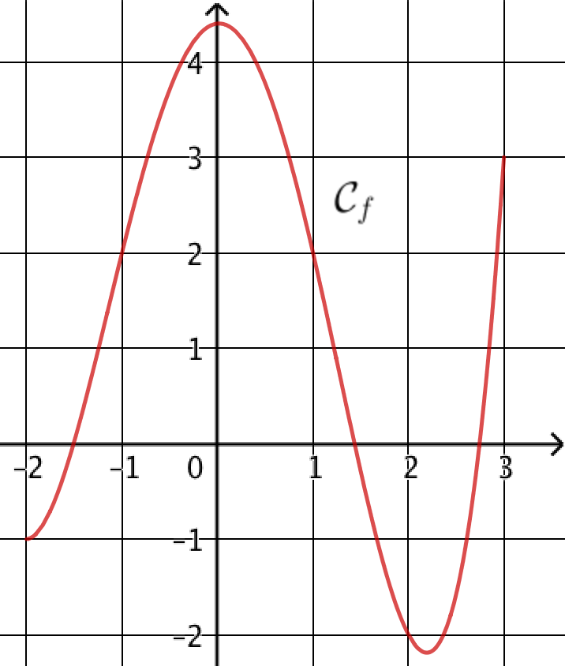
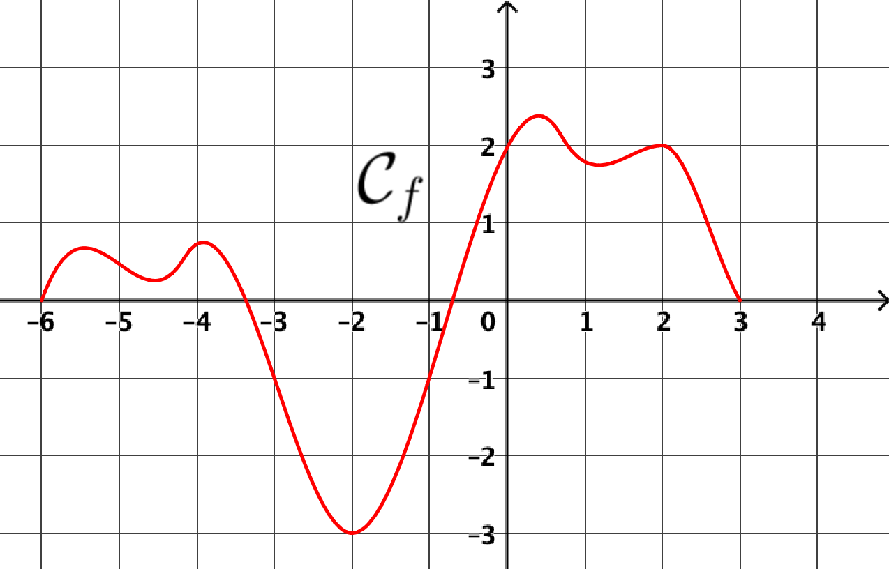
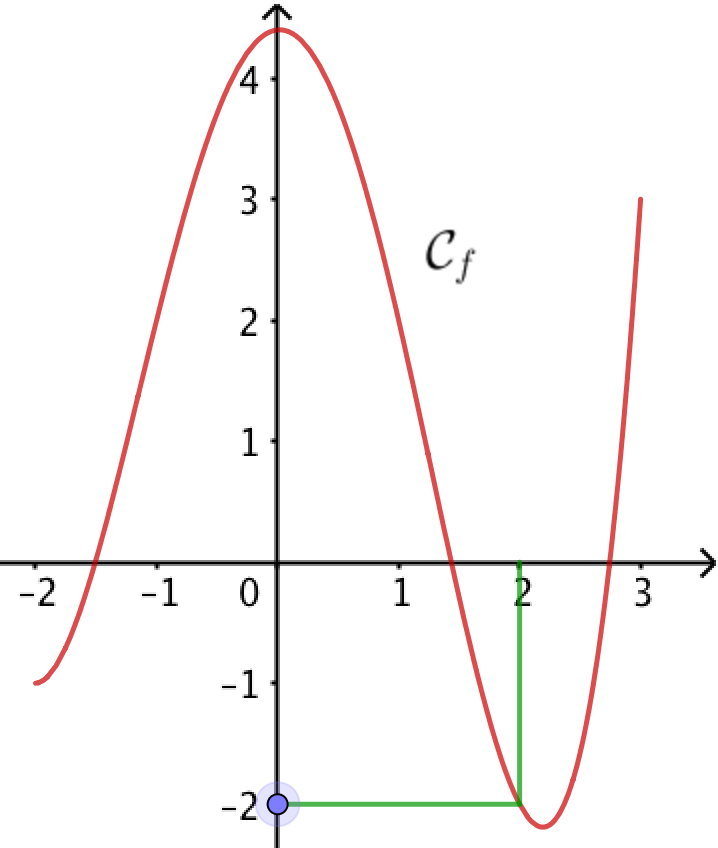
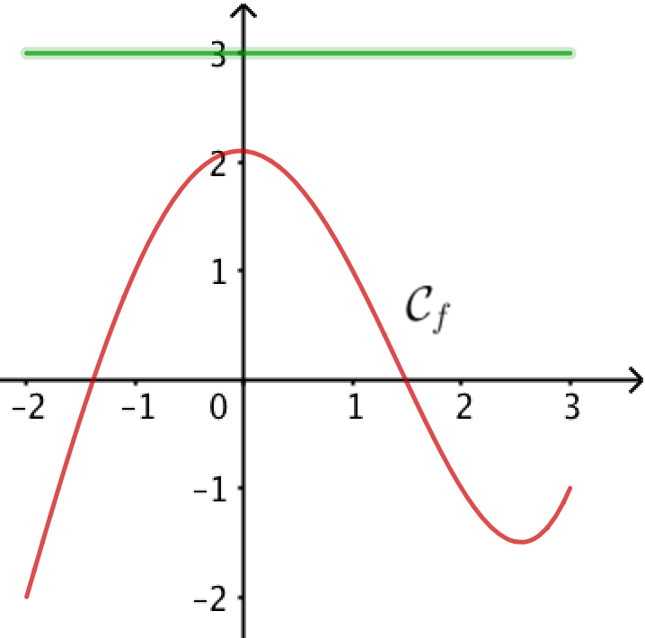
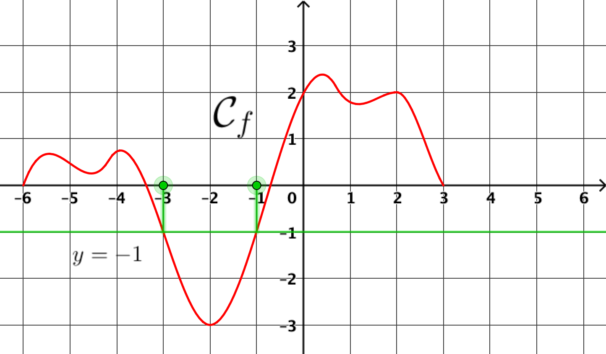
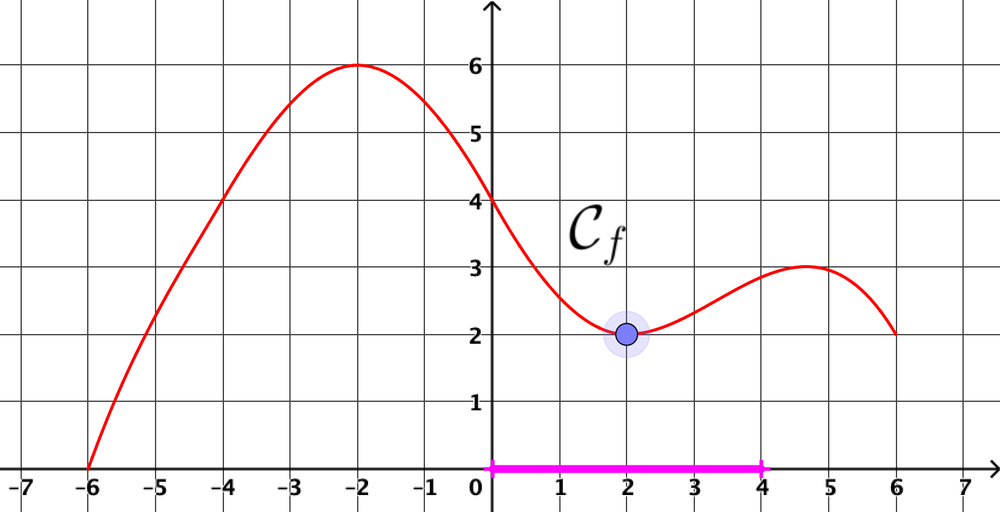
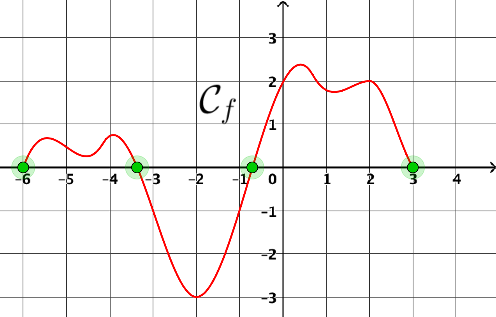
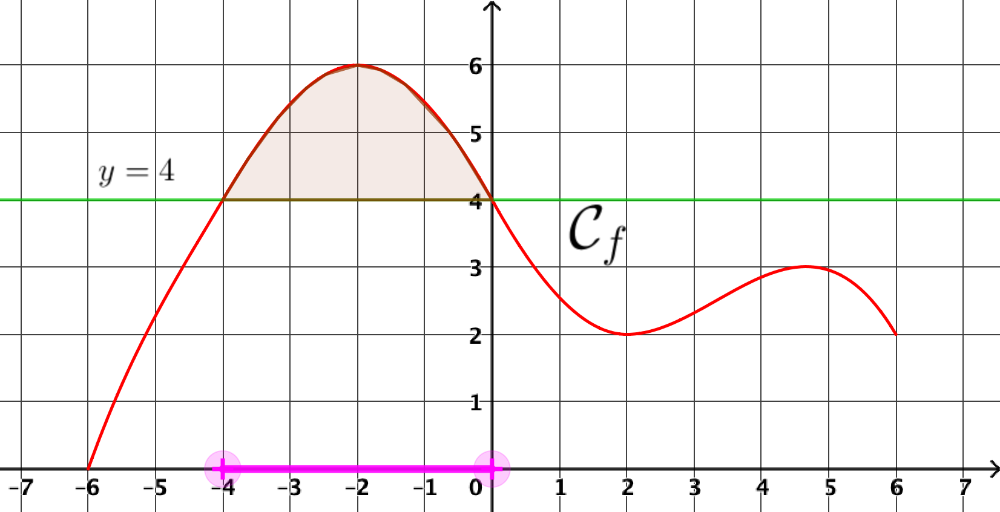

:backend: revealjs
:revealjs_theme: moon
:stem: latexmath
:revealjs_autoSlide: "20000"
:revealjsdir: ../reveal.js

== Préparez-vous !

(prendre un papier et un stylo)

== !

Déterminer stem:[\; f(1)]

== !

image::img/fonc_12.png[fonc_12,width=350]

Déterminer les éventuels antécédents de stem:[\; 1] par stem:[\; f]

== !

Déterminer stem:[\; f(2)]

== !

image::img/fonc_12.png[fonc_12,width=350]

Déterminer les éventuels antécédents de stem:[\; 3] par stem:[\; f]

== !

Résoudre l'équation stem:[\; f(x) = -1]

== !

image::img/sec_fonc_21.png[width=550]

Déterminer le minimum de stem:[\; f] sur [0;4].

== !

Déterminer le nombre d'antécédents de stem:[0] par stem:[\; f].

== !

image::img/sec_fonc_21.png[width=550]

Déterminer le maximum de stem:[\; f]

== !

image::img/sec_fonc_21.png[width=550]

Résoudre l'inéquation stem:[\; f(x) \geq 4]

== Solutions

== !

image::img/fonc_16.png[fonc_16,width=350]

Déterminer stem:[\; f(1)]

[.step]
* stem:[f(1) = 2]

== !

image::img/fonc_14.png[fonc_14,width=350]

Déterminer les éventuels antécédents de stem:[\; 1] par stem:[\; f]

[.step]
* Deux antécédents stem:[\; -1] et stem:[\; 1]

== !

Déterminer stem:[\; f(2)]

[.step]
* stem:[f(2) = -2]

== !

Déterminer les éventuels antécédents de stem:[\; 3] par stem:[\; f]

[.step]
* 3 ne possède pas d'antécédent par stem:[\; f]

== !

Résoudre l'équation stem:[\; f(x) = -1]

stem:[S = ] {-3; -1}

== !

Déterminer le minimum de stem:[\; f] sur [0;4].

Le minimum sur [0;4] est stem:[2]

== !

Déterminer le nombre d'antécédents de stem:[0] par stem:[\; f].

[.step]
* 4

== !

image::img/sec_fonc_21_max.png[width=550]

Déterminer le maximum de stem:[\; f]

[.step]
* 6

== !

Résoudre l'inéquation stem:[\; f(x) \geq 4]

[.step]
* S = [-4;0]
