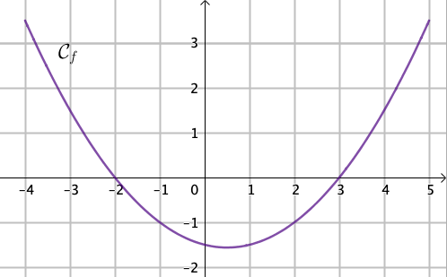

:backend: revealjs
:revealjs_theme: moon
:stem: latexmath
:revealjs_autoSlide: "20000"
:revealjsdir: ../reveal.js

== Préparez-vous !

== !

Résoudre l'équation stem:[\; \large{f(x) = g(x)}]

== !

stem:[\; \large{f(x) = x ^ 2\;}] pour tout x réel.

Calculer stem:[\; \large{f(-7)}]

== !

Donner le tableau de signe de stem:[f].

== !

stem:[\; \large{f(x) = x + 3\;}] pour tout x réel.

Résoudre stem:[\; \large{f(x) = 7}]

== !

Résoudre stem:[\; \large{2 x + 1 = x + 5}]

== !

Donner le tableau de signe de la fonction affine ci-dessus

== Solutions

Résoudre l'inéquation stem:[\; \large{f(x) = g(x)}]

== !

stem:[\; \large{f(x) = x ^ 2\;}] pour tout x réel.

Calculer stem:[\; \large{f(-7)}]

[.step]
* stem:[(-7)^2 = -7 \times (-7) = 49]

== !

Donner le tableau de signe de stem:[f].

== !

stem:[\; \large{f(x) = x + 3\;}] pour tout x réel.

Résoudre stem:[\; \large{f(x) = 7}]
[.step]
* stem:[x + 3 = 7 ]
* stem:[x + 3 - 3 = 7 - 3]
* stem:[x = 4 ]

== !

Résoudre stem:[\; \large{2 x + 1 = x + 6}]
[.step]
* stem:[2 x - x + 1 = x - x+ 6]
* stem:[x  + 1 - 1 = 6 - 1]
* stem:[x = 5 ]

== !

