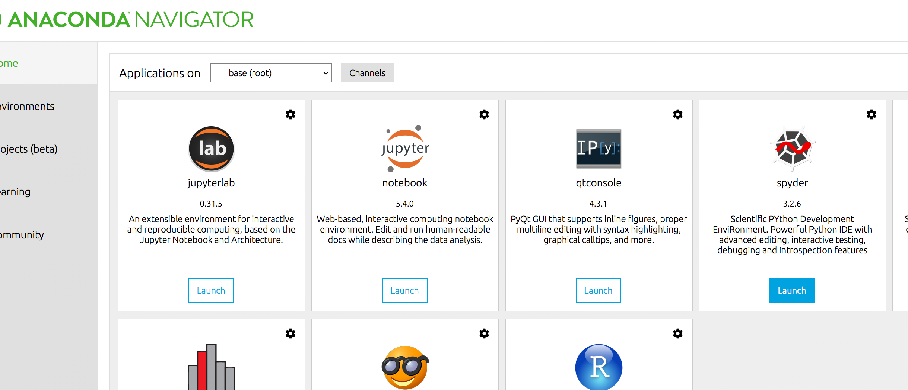
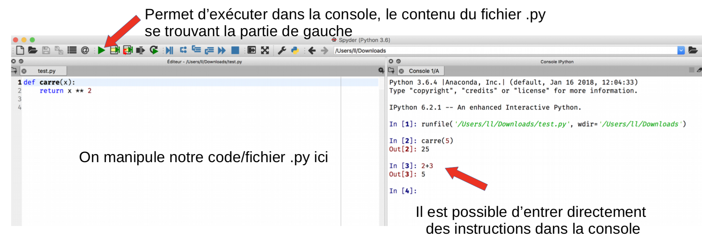
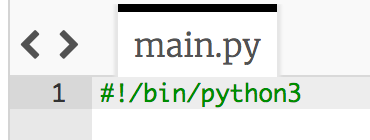

:backend: revealjs
:revealjs_theme: moon
:stem: latexmath

= Algorithme et programmation en Python au lycée, première partie: Pourquoi Python ?
:source-highlighter: pygments
:pygments-style: tango

== Analyse de l'aménagement des programmes et de l'évolution de l'écriture des algorithmes.

On pourra retrouver
link:http://media.education.gouv.fr/file/30/52/3/programme_mathematiques_seconde_65523.pdf#page=9[la version non aménagée du programme ici]
 et
link:http://cache.media.education.gouv.fr/file/18/95/3/ensel512_maths_757953.pdf#page=9[la version aménagée ici].

=== !

[%step]
* Le mot programmation apparait dans le titre mais était déjà présent avant
* Disparition de la mention: &laquo;objectifs pour le lycée&raquo;
* &laquo;langage de programmation textuel&raquo; => différence collège/lycée
* notion de type explicité mais déjà présente implicitement
* La principale différence: la notion de fonction/disparition des instructions d’entrées et sorties.

=== !

image::../formation/images/ancienprogramme.png[Ancienne version]

=== !

image::../formation/images/nouveauprogramme.png[Nouvelle version]

=== Instructions d'entrée-sortie et fonction

* Le découpage: entrées-corps-sortie est considéré comme problèmatique.
** Trop simpliste
** Ne permet que de communiquer avec un utilisateur
* _saisir_/_afficher_ ne sont pas des notions d'algorithmique

=== !

Ce qui compte, c'est que l'algorithme prend des données en paramètres et renvoie
des données en réponse. Ce qui correspond donc à la notion de fonction.

=== !

link:http://cache.media.eduscol.education.fr/file/Mathematiques/73/3/Algorithmique_et_programmation_787733.pdf[le nouveau document ressource sur l'algorithmiqe]
qui nous dit:

[quote]
On notera que les notions d’entrées-sorties (fonctions input et print)
ne  sont  pas  développées dans ce document: elles ne relèvent pas de la
pensée algorithmique et l’accent mis par le programme sur la notion de fonction
permet de s’en libérer complètement.

=== !

Et dans link:https://euler.ac-versailles.fr/IMG/pdf/evolution_ecriture_algorithmes.pdf[le document sur l'écriture des algorithmes produit par l'inspection générale.]:

[quote]
Dans un objectif de simplicité et de cohérence, il est proposé une évolution de
 l’écriture des algorithmes dans les sujets de baccalauréat obéissant aux
 principes suivants : [...] suppression des entrées-sorties ;

=== !

image::../formation/images/nouvelleecriture.png[alt]

=== !

link:http://revue.sesamath.net/spip.php?article1039[la revue sesamath] propose
une modernisation de l'écriture d'un très grand nombre d'algorithmes donnés au
baccalauréat

=== !

[%step]
* Cette vision de l'algorithmique était très marquée par la calculatrice.
Il faut utiliser d'autres langages pour en sortir.
* D'où pour en sortir, l'utilisation d'un langage &laquo; interprété &raquo;

=== L’interprète de commande

En effet, il est possible d'utiliser les langages interprétés dans un
interprèteur intéractif de commande, on parle aussi de mode console, et en anglais de
Read–eval–print loop (Repl).

Le mode console va nous permettre d'interagir avec la machine et d'utiliser
les fonctions que nous avons programmées sans avoir à utiliser d' `input()`/`print()`.

== Utiliser Python en pratique

=== Avec Anaconda

Ouvrir l'IDE Spyder directement depuis le bureau ou en passant par Anaconda:

=== !

L'idée est de créer des fonctions dans un fichier .py, manipulée dans la
partie de gauche, passer ce code à l'interpréteur (via la fléche verte) puis
utiliser ces fonctions dans l'interpréteur.

=== Les solutions en lignes

* link:https://www.pythonanywhere.com/[pythonanywhere.com] Très bien mais pose
deux problèmes, le code est exécuté à distance, c'est donc souvent très lent au
lycée. Et il n'est pas possible d'utiliser turtle.
* link:https://repl.it/[repl.it] Même problème avec un code qui est exécuté à
distance, de plus s'il y a bien une console de proposée, il est assez
complexe de faire le lien avec l'éditeur de texte sur le côté.
* link:https://trinket.io/[trinket.io] Il est possible d'exécuter le code à
distance ou directement dans le navigateur. (mais sans les bibliothéques scientifiques)

=== Avec trinket

image::../formation/images/tr-choix23.png[version,300,100]

Il y a deux modes possibles, python et python3, il n'est pas possible de
sauvegarder avec le mode python3 et le code est exécuté à distance mais il
est possible d'utiliser les bibliothéques scientifiques.

=== !

Lorsque l'on utilise le mode python, il faut entrer le shebang: `#!/bin/python3`

=== !

image::../formation/images/tr-console.png[console,300,100]
Il faut passer systématiquement en mode console. Et cliquer sur console pour
exécuter le code.
