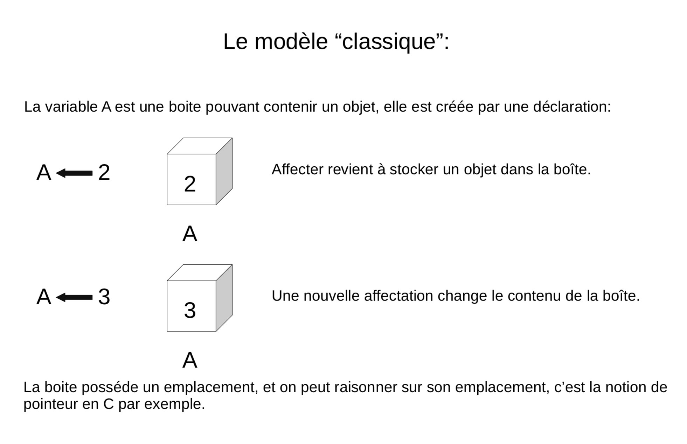
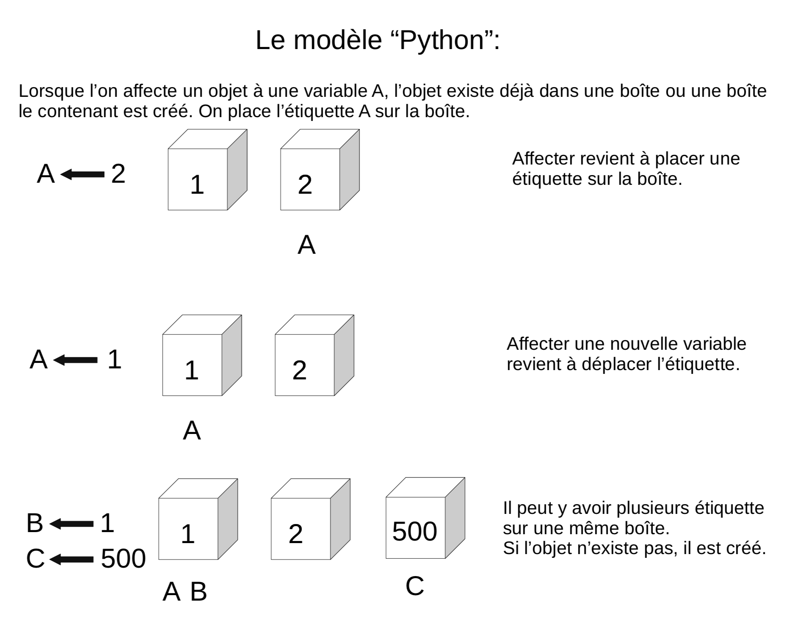
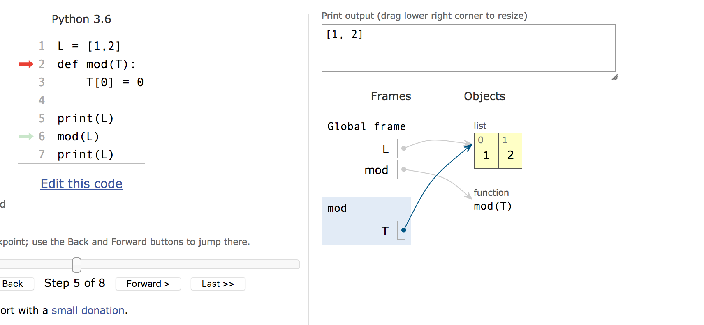

:backend: revealjs
:revealjs_theme: moon
:stem: latexmath

= Algorithme et programmation en Python au lycée, deuxième partie: Le langage Python
:source-highlighter: pygments
:pygments-style: tango

== !

image::https://media1.giphy.com/media/HfJdu4HABDU3e/200w.gif[monty,500,500]

== Les types

=== Les types simples

Il y a 3 types au programme: entier, flottant et chaîne de caractères.
En Python, ils vont correspondre au type _int_ (integer), _float_, _str_ (string).

=== !

* Pas de type caractère en Python, uniquement un type chaîne de caractères. (
* Plusieurs syntaxe pour les chaines de caractères:

[source,python]
----
"Je suis une chaîne !"
'Moi aussi'
"""Et moi !"""
----

=== !

[source,python]
----
'Cela qui permet, cela: "'
----

=== !

Il existe aussi un type booléen qui ne contient que les valeurs `True` et
`False` dont il ne semble pas nécessaire de parler aux élèves.

=== La fonction type

La fonction `type()` renvoie le type d'une donnée:

[source,python]
----
>>> type("p")
<class 'str'>
>>> type(2)
<class 'int'>
>>> type("2")
<class 'str'>
>>> type(2.0)
<class 'float'>
----

=== Conversion

Il existe plusieurs fonctions qui permettent de forcer le type d'une variable en un autre type.

[source,python]
----
>>> int("3")
3
>>> int(3.14)
3
----

[source,python]
----
>>> a = "2"
>>> b = float(a)
>>> type(b)
<class 'float'>
----

=== Les types composées

Il existe en Python des types composées de plusieurs types, tels que les tuples
et les listes.

Ces types ne sont pas au programme, mais ils sont omniprésents en Python

=== Tuple

Un tuple correspond en fait à ce que nous appellerions un stem:[n]-uplet, il
s'écrit: stem:[(elem1, elem2, ...)]

[source,python]
----
>>> type((4,5,7,-2))
<class 'tuple'>
>>> type((3,"toto"))
<class 'tuple'>
----

=== !

Les parenthèses sont optionnelles:

[source,python]
----
>>> 3, 4
(3, 4)
----

=== !

Les tuples ne sont pas mutables. (Nous verrons plus loin ce que cela veut dire.)

== L'affectation

La syntaxe pour l'affectation en Python est: =

[source,python]
----
>>> a = 5
----

=== !

Python est un langage dont le typage est dynamique. Cela signifie que c’est
l’ordinateur, et non pas le programmeur, qui se charge de «typer» les variables.

La déclaration est implicite lors de l'affectation.

=== !

[source,python]
----
>>> a = 3
>>> type(a)
<class 'int'>
>>> a = "toto"
>>> type(a)
<class 'str'>
----

=== Attention confusion

* Le fait que l'affectation se note = est une source infinie de confusion !
* Il y a un travail important à fournir pour distinguer = en Python du = mathématiques.
* En particulier, il ne faut jamais prononcer le = en Python «égal».
On parle d'affectation, on dit qu'on stocke la donnée dans la variable, etc.

=== !

A l'écrit/en pseudo-code, il faut bien insister sur le fait que l'affectation
se note stem:[\longleftarrow]

(Il est possible que l'on retrouve cette flèche au bac cette année )

=== Nom de variable

[%step]
* Le nom de la variable est une suite de lettres (minuscules ou majuscules,
pas d'accents) et de chiffres, qui doit toujours commencer par une lettre,
et qui ne contient pas de caractères spéciaux en dehors de l'underscore _
* Attention les élèves mettent des espaces dans les noms de variables

=== Bien nommer

Bien nommer les variables fait plaisir à Camus (Albert..) et aux profs d'I.S.N

Et peut être qu'un jour, nommer ses variables comme un mathématicien ne sera
plus une insulte !

=== Le modèle des boîtes:

=== !

=== Affectation et tuples:

[source,python]
----
>>> t = (3, 4)
>>> t
(3, 4)
>>> (a,b) = (1,2)
>>> a
1
----

=== !

Or, nous avons vu que les parenthèses étaient optionnelles, on peut donc faire:

[source,python]
----
>>> a, b = 1, 2
>>> a, b = b, a
>>> a
2
>>> b
1
----

=== Idées d'exercices sur l'affectation

. Applications de différentes formules: aires, volumes, IMC, physiques
. Programme de calcul
. Formule de la distance
. Formule du milieu

== Sortie

Si `afficher`, `lire`/`saisir` sont à proscrire en algorithmique et qu'il vaut
mieux privilégier l'utilisation d'une console en programmation, la fonction
`print()` reste très utile à des fins de débuggage.

=== Syntaxe

[source,python]
----
print(4)
print("Hello world !")
----

=== !

Il y par défaut un saut à la ligne. Pour l'éviter, on peut modifier le paramètre
 `end` de la sorte:

[source,python]
----
print(4,end="")
print("Hello world !")
----

== Arithmétique en Python

|===
| x + y | somme de x et y

| x - y
| différence entre x et y

| x * y
| produit de x par y

| x / y
| quotient de x par y, renvoie un flottant

| x ** y
| x puissance y
|===

=== !

|===
| x // y
| quotient de la division euclidienne de x par y

| x % y
| reste de la division euclidienne de x par y
|===

=== !

On peut noter que les élèves ont tendance à oublier la syntaxe de
la puissance et que les puissances non entières sont acceptées.

== Présentation générale de la syntaxe Python

La principale caractéristique de la syntaxe de Python est que l'indentation
est significative et permet de délimiter les blocs d'instructions.

=== !

[source,python]
----
i = 0
while i < 100:
  i = i + 1
print(i)
#Ce programme affiche 100
----

[source,python]
----
i = 0
while i < 100:
  i = i + 1
  print(i)
#Ce programme affiche tout les nombres de 1 à 100
----

=== !

Par convention l'indentation est de 4 espaces mais cela n'est qu'une convention,
un code écrit avec une indentation représentée par une tabulation ou juste 2
espaces ne posera pas de problème.

=== !

Il faut cependant rester cohérent:

[source,python]
----
i = 0
while i < 100:
  i = i + 1
   print(i)
#Il y aura une erreur car l'indentation n'est pas
#la même sur les deux dernières lignes.
----

=== Le petit piège vicieux

[source,python]
----
 i = 0
#Ici aussi il y a une erreur
# Il y a un espace entre le début de ligne et le `i`
----

Cette erreur est très courante chez les élèves.

=== !

Une autre source d'erreur est le copier/coller de code, en particulier,
 il est possible que l'indentation apparaisse exacte sans l'être dans le cas
 où l'éditeur de texte fait une différence entre une tabulation et 4 espaces.

(J'utilise en général la tabulation à la place des espaces, il est donc possible
de rencontrer cette erreur pendant la formation)

=== !

[source,python]
----
en−tête:
    bloc ...........................
    ................................
    d instructions..................
----

* Le début d’un bloc d’instructions est défini par un double-point.
* Le corps du bloc est alors indenté d’un nombre d’espaces fixes
 et le retour à l’indentation de l’en-tête marque la fin du bloc.

=== !

Les élèves ont souvent des difficultés à se souvenir du deux points `:`

=== !

Il est possible d’imbriquer des blocs d’instructions les uns dans les autres :

[source,python]
----
en−tête:
    bloc ...........................
    ................................
    d instructions .................
    en−tête bis:
        bloc .......................
        ............................
        d instructions .............
    ................................
    ................................
----

== Instructions conditionnelles

[source,python]
----
if expression booléenne:
    bloc..............
    d instructions 1..
else:
    bloc..............
    d instructions 2..
----

=== !

[source,python]
----
>>> a = 7
>>> if (a % 2 == 0):
...    "a est pair"
... else:
...    "a est impair"
...
"impair"
----

=== !

L’instruction 'else' est optionnelle si aucune instruction ne doit
être réalisée dans le cas d’un test négatif.

=== Instructions conditonnelles multiples

En informatique il est fréquent qu’on ait à imbriquer plusieurs tests,
aussi existe-t-il en python un mot clé `elif`
(qui est la contraction de else if) et qui fonctionne suivant le schéma :

[source,python]
----
if expression booleenne 1:
    bloc..............
    d instructions 1..
elif expression booleenne 2:
    bloc..............
    d instructions 2..
else:
    bloc..............
    d instructions 3..
----

=== !

* Il semble préférable d'éviter de présenter `elif` aux élèves, et garder
une syntaxe la plus concise possible.
* Il n'y a pas de limite au nombre de `elif`
* Il n'y a pas de `switch` en Python.

=== Opérateurs de comparaison

|===
| En python | Signification

| x < y
| inférieur strictement

| x \<= y
| inférieur ou égal

| x > y
| supérieur strictement

| x >= y
| supérieur ou égal

| x == y
| égal

| x != y
| différent de
|===

=== !

Même si cela ne relève pas du programme de seconde il peut être utile de savoir
que les opérateurs et, ou, non se notent tout simplement `and`, `or` et `not`.

=== Idées d'exercices sur l'instruction conditionnelle

. Déterminer si un triangle est rectangle, isocèle, équilatéral. Séparé ou non.
. Fonction affine par morceau (valeur absolue, seuil, prix photocopie, etc.)
. Admis/2nd groupe/Recalé
. Application IMC
. Parité, divisibilité
. Année bissextile
. Jour correspondant à une date (bien avec les dictionnaires Python)

== Structures itératives

=== Boucle for/Pour

[source,python]
----
for ... in range(...):
    bloc..........................
    ..............................
    d instructions ...............
----

Immédiatement après le mot-clé `for` doit figurer le nom d’une variable,
qui va prendre les différentes valeurs de l’énumération produite par l’instruction `range`.
Pour chacune de ces valeurs, le bloc d’instructions qui suit sera exécuté.

=== !

[source,python]
----
for i in range(3):
    print("Hello world !")
----

Dans ce cas la variable d'énumération n'est pas utilisée. Ce cas est en
général relativement bien compris par les élèves.

=== !

[source,python]
----
for nbr in range(5):
    print("Le carre de:", nbr, "est", nbr ** 2)
----

La variable d'énumération est ici utilisée. D'expérience, cela pose beaucoup
plus de problèmes aux élèves et le `range` de Python semble ne pas aider,
il peut donc être préférable de commencer par utiliser une boucle
tant que pour ce genre de cas.

=== Le type `range`

`range` donne une suite d'entier et peut prendre entre 1 et 3 arguments entiers :

* `range(b)` commence par 0 et s'arrête juste avant `b` +
`range(5)` correspond à [0, 1, 2, 3, 4]

* `range(a,b)` commence par `a` et s'arrête juste avant `b` +
`range(2,7)` correspond à [2, 3, 4, 5, 6]

* `range(a,b,c)` commence par `a` et s'arrête juste avant `b` avec un pas de `c` +
`range(1,10,2)` correspond à [1, 3, 5, 7, 9]

=== !

Il ne semble pas utile de mentionner que `range` est un type, et il est sûrement
préférable de se limiter à un seul paramètre compte tenu des difficultés des
élèves avec ces notions.

=== Les types itérables

Un grand nombre de types en Python est dit itérable, c'est le cas par
exemple des chaînes de caractères, des tuples, des listes, etc.

=== !

On peut directement boucler sur les itérables:

[source,python]
----
>>> for c in "Lapie !":
...     print("Donnez moi un", c)
...
Donnez moi un L
Donnez moi un a
Donnez moi un p
Donnez moi un i
Donnez moi un e
Donnez moi un
Donnez moi un !
----

=== !

La boucle `Pour` en Python est donc extrêmement riche et permet de faire un très
grand nombre de choses, de sorte que la boucle `tant que` est en pratique
relativement peu utilisé en général. Il faut donc faire l'effort de laisser
toute sa place à la boucle tant que.

=== Boucle while/tant que

[source,python]
----
while condition:
    bloc..........................
    ..............................
    d instructions ...............
----

Il est bien sûr important de mettre en garde les élèves contre les boucles
infinis.

=== Idées d'exercices sur les boucles

. Calcul d'intérêt
. Chute d'un corps
. Calcul de différentes sommes: (limite de la somme des inverses des carrés ?)
. Répétition d'expériences probabilistes
. Tracé de courbes
. Suites
. Rang

== Le type list

Il n'y pas de tableau en Python, il y a à la place un type `list` très puissant
qui est une sorte de mélange entre un tableau dynamique et une liste doublement
chaînée.

=== !

Le type `list` ou les tableaux ne sont pas au programme, cependant il est
difficile de s'en passer pour illustrer certaines notions, et il semble donc
raisonnable d'utiliser les listes dans certains T.P.

=== Définition et syntaxe

Une liste est une "collection" d'objets indicée.

[source,python]
----
>>> course = ["beurre","tomates","PQ" ]
>>> type(course)
<class 'list'>
----

=== !

Le type `list` est un type composite, il rassemble des objets d'autres types.

[source,python]
----
>>> ma_liste = [42, "toto", [4,5]]
----

=== Opérations sur les listes

=== Accéder

On peut accéder à un élément particulier d'une liste à l'aide de son index dans la liste:

[source,python]
----
>>> course = ["beurre","tomates","PQ" ]
>>> course[2]
'PQ'
>>> course[0]
'beurre'
----

Attention on commence à compter à partir de 0.

=== Modifier

On peut modifier un élément de la liste de la sorte:

[source,python]
----
>>> course[1] = "carrotes"
>>> course
 ['beurre', 'carrotes', 'PQ']
----

=== Ajouter

On peut ajouter un élément à la fin de la liste de la sorte:

[source,python]
----
>>> course.append("lait")
>>> course
 ['beurre', 'carrotes', 'PQ', 'lait']
----

=== Supprimer

Et supprimer un élément selon son indice:
[source,python]
----
>>> del(course[2])
>>> course
 ['beurre', 'carrotes', 'lait']
----

=== Arithmétique

On peut concaténer des listes avec les opérations + et *

[source,python]
----
>>> oubli = ["huile","PQ"]
>>> course = course + oubli
>>> course
 ['beurre', 'carrotes', 'lait', 'huile', 'PQ']
----

=== Mesurer

On peut obtenir la longueur d'une liste avec la fonction `len`

[source,python]
----
>>> len(course)
 5
----

=== Parcourir

On peut parcourir une liste de plusieurs façon:

[source,python]
----
>>> for i in course:
...     print(i)
...
beurre
carrotes
lait
huile
PQ
----

=== !

[source,python]
----
>>> for i in range(len(course)):
...     print(course[i])
...
beurre
carrotes
lait
huile
PQ
----

=== Liste vide

On peut créer une liste vide:
[source,python]
----
>>> ma_liste = []
----

=== Type mutable

Tous les types que nous avons vu jusqu'à présent étaient immutables, cela veut
dire qu'on ne pouvait pas les modifier.

[source,python]
----
>>> a = 2 #On met l'étiquette a sur 2
>>> b = a #On met l'étiquette b sur 2
>>> a = 3 #2 n'est pas modifié, seule l'étiquette a est placé sur 3
>>> b     #l'étiquette b est toujours sur 3
2
----

=== !

[source,python]
----
>>> a = [4,5] #On met l'étiquette a sur la liste [4,5]
>>> b = a #On met l'étiquette b sur la liste [4,5]
>>> a[0] = 6 #Ici la liste a est modifiée
>>> b     #l'étiquette b est toujours sur la même liste
[6,5]
----

Inutile de dire que c'est une source d'erreur importante, et qu'il faut faire
attention lors de la manipulation des listes.

=== Tri

Pour trier une liste, on peut utiliser:

[source,python]
----
ma_liste.sort() #ce qui modifie la liste
nouvelle_lst = sorted(ma_liste) #une nouvelle liste est crée
----

(C'est pratique pour les statistiques..)

=== Listes en compréhension

La notion de liste en compréhension s'inspire des ensembles mathématiques
de la forme stem:[\{ x \; | \; P(x) \}] ou encore stem:[\{ f(x) \; | \; x \in E \}]

=== !

[source,python]
----
>>> carres = [x ** 2 for x in range(10)]
>>> carres
[0, 1, 4, 9, 16, 25, 36, 49, 64, 81]
----

=== !

[source,python]
----
>>> pairs = [i for i in range(10) if i % 2 == 0 ]
>>> pairs
[0, 2, 4, 6, 8]
----

=== !

Même si la notion de liste en compréhension n'est pas primordiale, c'est souvent
la façon la plus lisible de créer des listes.

=== Autres types proches

A noter que la manipulation de listes est assez lente, pour les applications
gourmandes en calculs, on ira plutôt chercher d'autres types beaucoup plus proche
de la machine dans des modules tels que numpy ou array.

=== Dictionnaires

Il existe un type dict proche des listes

[source,python]
----
mois = {"janvier": 0 ,"fevrier": 3,"mars": 3,"avril": 6, "mai": 1, "juin": 4}
mois["mars"]
mois["juillet"] = 6
----

(Cela peut servir pour l'algo du jours d'une date.)

== Fonctions

L'introduction de la notion de fonction est le fait marquant de l'aménagement
du programme, il est sûrement plus important que l'utilisation de Python,
et amène une nouvelle façon d'écrire les algorithmes.

=== Syntaxe

On définit une fonction en python à l’aide du mot clé `def`.
Il faut lui attribuer un nom, préciser la liste de ses paramètres et enfin
décrire les différentes instructions à réaliser.

[source,python]
----
def nomdelafcn(liste de paramètres):
  bloc ...........................
  d instructions .................
  a realiser .....................
----

=== Return

[source,python]
----
def hi():
  print("hello world !")
----

[source,python]
----
def f(x):
  return x ** 2 - 3 * x + 4
----

=== !

On distingue en général en informatique deux types de routines: les procédures,
qui ne retournent pas de résultat et qui agissent sur l'environnement (par
  exemple avec un `print()`), et les fonctions, qui retournent un résultat en
général par le biais de l'instruction `return`.

En Python, il n’existe que des fonctions: lorsque l'instruction `return` n'est
pas utilisée, la valeur `None` est retournée.

=== !

Dans le cadre du programme de seconde, il est préférable que les fonctions
renvoient systématiquement et explicitement une valeur

=== !

[source,python]
----
def pgcd(a,b) :
   while a%b != 0 :
      a, b = b, a%b
   return b
----

=== !

La rencontre de l'instruction `return` lors que l'exécution marque la fin
de l'exécution de la fonction.

[source,python]
----
def pgcd(a,b) :
  if b == 0:
    return a
  while a%b != 0 :
    a, b = b, a%b
    return b
----

Il peut y avoir plusieurs `return` dans une fonction.

=== !

Il y a deux traductions de `return` en pseudo-code, Retourner
et Renvoyer.

Dans le document sur l'évolution de l'écriture, c'est le mot Retourner qui
est privilégié, mais il est assez probable qu'à l'avenir cela change en faveur
de Renvoyer. Il faut donc habituer les élèves aux deux formulations.

=== !

Il est possible de renvoyer plusieurs valeurs à l'aide des tuples:

[source,python]
----
def premier_terme(M):
  u = 1
  n = 0
  while u < M:
    u = u * 2
    n = n + 1
  return n, u
----

[source,python]
----
>>> premier_terme(1000)
(10, 1024)
----

=== !

Ce qui est attendu sur la gestion des retours multiples, en différentes
quantités, de différents types reste une des grandes inconnues

=== Paramètre d'une fonction

Le document ressource propose l'exemple suivant:

[source,python]
----
def dichotomie(f,a,b,epsilon=0.0001):
  while b - a > epsilon:
    c = (a+b)/2
    if f(a)*f(c) <= 0:
      a, b = a, c
    else:
      a, b = c, b
  return (a+b)/2
----

[%step]
* Fonction en paramètre (possible mais pas nécessaire)
* `epsilon=0.0001`, cela correspond à un paramètre par
défaut, c'est à dire que si l'utilisateur n'entre pas de valeurs pour ce
paramètre, il vaudra `0.0001` par défaut.

=== !

[source,python]
----
>>> def cube(x):
...     return x ** 3
...
>>> dichotomie(cube,-1,1)
-3.0517578125e-05
>>> dichotomie(cube,-1,1,0.1)
-0.03125
>>> dichotomie(cube,-1,1,epsilon=0.01)
-0.00390625
----

=== !

Il semble préférable d'éviter de demander aux élèves de créer des fonctions avec
des paramètres optionnelles, mais ils peuvent se révéler particulièrement
pratiques dans le cas de création d'une bibliothèque par l'enseignant.

=== Assert

On retrouve dans le document ressource l'utilisation de l'instruction `assert`
qui permet de renvoyer une erreur si certaines conditions ne sont pas vérifiées.

[source,python]
----
def pgcd(a,b) :
  assert(a >0 and b>0)
  while a%b != 0 :
    a, b = b, a%b
    return b
----

[source,python]
----
>>> pgcd(0,0)
Traceback (most recent call last):
  File "<stdin>", line 1, in <module>
  File "<stdin>", line 2, in pgcd
AssertionError
----

=== !

Il semble cependant plus simple d'éviter les cas problématiques avec les élèves
plutôt que d'introduire cette notion.

=== Portée des variables

Une notion complexe

image::https://media3.giphy.com/media/2yP1jNgjNAkvu/200w.gif[lapin]

=== !

* La portée d'une variable est l'endroit du programme où on peut accéder à la variable.
* Les variables définies dans le bloc d'instruction d'une fonction, n'ont qu'une portée locale.
* Autrement dit, leur contenu est inaccessible depuis l’extérieur de la fonction.

=== !

[source,python]
----
def f(x):
  carre = x ** 2
  return carre

print(carre)
----

Ce code produit l'erreur: NameError: name 'carre' is not defined

=== !

Les variables définies à l'extérieur d'une fonction sont des variables globales.
Leur contenu est « visible » de l'intérieur d'une fonction, mais la fonction ne
peut pas le modifier.

+++
<iframe width="800" height="500" frameborder="0" src="http://pythontutor.com/iframe-embed.html#code=a%20%3D%2010%20%20%20%20%20%20%20%20%23%20variable%20globale%20au%20programme%0A%0Adef%20mafonction%28%29%3A%0A%20%20%20%20a%20%3D%2020%20%20%20%20%23%20variable%20locale%20%C3%A0%20la%20fonction%0A%20%20%20%20print%28a%29%0A%20%20%20%20%0Aprint%28a%29%0Amafonction%28%29%0Aprint%28a%29&codeDivHeight=400&codeDivWidth=350&cumulative=false&curInstr=0&heapPrimitives=false&origin=opt-frontend.js&py=3&rawInputLstJSON=%5B%5D&textReferences=false"> </iframe>
+++

link:http://pythontutor.com/iframe-embed.html#code=a%20%3D%2010%20%20%20%20%20%20%20%20%23%20variable%20globale%20au%20programme%0A%0Adef%20mafonction%28%29%3A%0A%20%20%20%20a%20%3D%2020%20%20%20%20%23%20variable%20locale%20%C3%A0%20la%20fonction%0A%20%20%20%20print%28a%29%0A%20%20%20%20%0Aprint%28a%29%0Amafonction%28%29%0Aprint%28a%29&codeDivHeight=400&codeDivWidth=350&cumulative=false&curInstr=0&heapPrimitives=false&origin=opt-frontend.js&py=3&rawInputLstJSON=%5B%5D&textReferences=false[Si bug]

=== !

Le site link:http://pythontutor.com/[pythontutor] permet de bien visualiser
les différents espaces de noms et la portée des variables.

=== !

Les risques « d'accidents » sont surtout probables si on travail avec des listes:

[#fonction-mutable]
[link=https://goo.gl/oqT7GY]

== !

image::https://media1.giphy.com/media/OY2yEJAhmRmr6/200w.gif[500,500]
