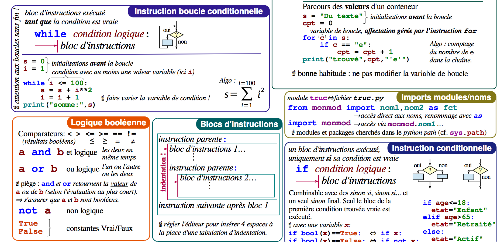
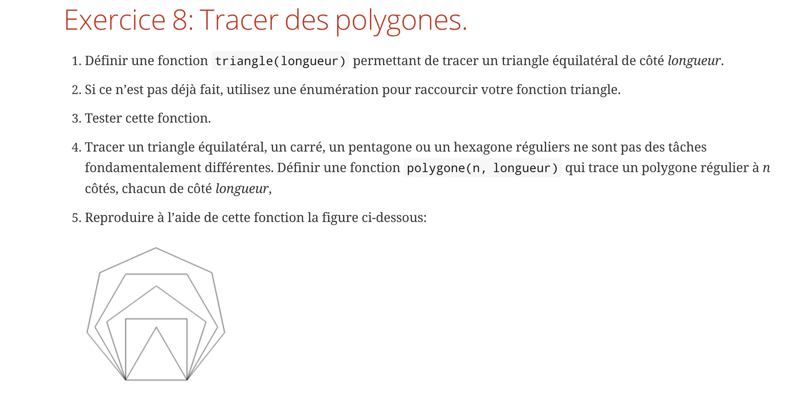
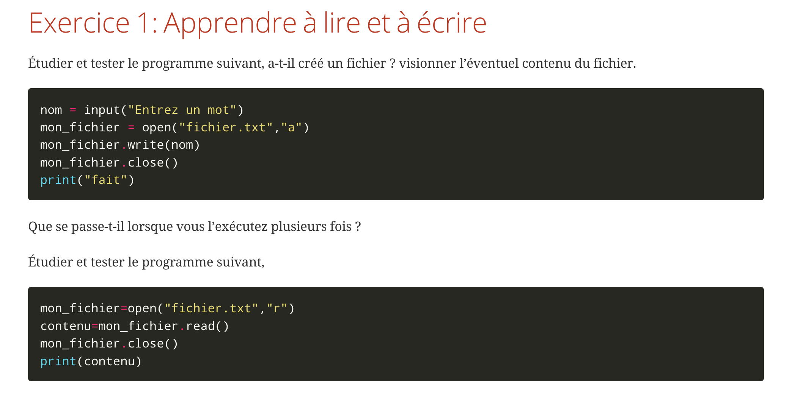
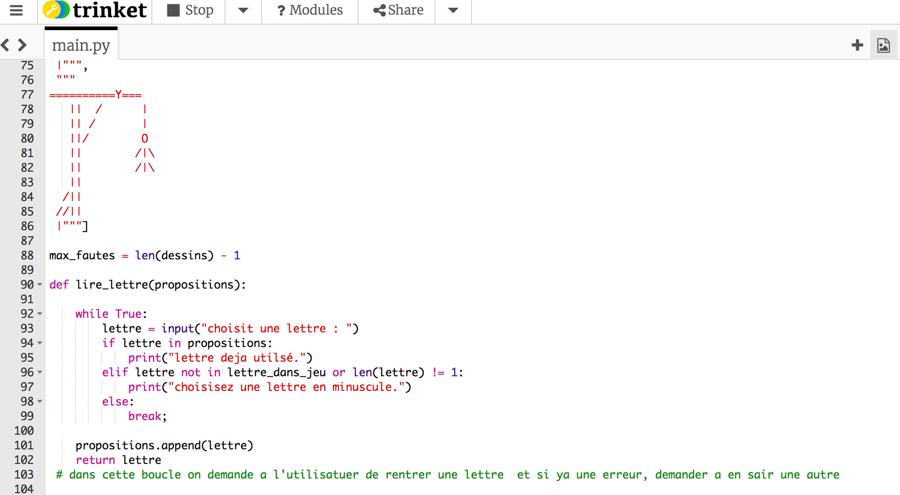

:backend: revealjs
:revealjs_theme: moon
:stem: latexmath
:revealjs_autoSlide: 10000
:revealjs_loop: true

= Numérique et sciences informatiques

== Qu'est ce que cette matière ?

L'informatique vu comme une science expérimentale.

== !

[quote, Michael R. Fellows Ian Parberry.]
____
Computer science is no more about computers than astronomy is about telescopes,
biology is about microscopes or chemistry is about beakers and test tubes.
____

== Pour qui ?

Pour les élèves:

* avec un profil "scientifique"
* prêt à travailler en groupe
* prêt à s'investir hors du temps de classe
* avec "un bon niveau" de mathématiques

== Quels contenus ?

Le programme de N.S.I s'organise autour de quatre concepts fondamentaux:

* Algorithmes
* Traitement et représentation des données
* Langages de programmation
* Machines et réseaux

== Pour quelles poursuites d'études ?

* Licence d'informatique, math-informatique, etc.
* Classes préparatoires scientifiques: une grande partie du programme de NSI
se retrouve dans les programmes de mathématiques et d'informatique des actuels: MPSI, PCSI, PTSI
* Ecoles d'ingénieurs post-bac
* I.U.T: informatique, génie électrique, génie mécanique, etc.
* Etudes scientifiques en général

== Quels &laquo;prérequis&raquo; ?

Les mathématiques ont un rôle fondamental en informatique.

Pour cela, il est *fortement recommandée de suivre la spécialité mathématiques* conjointement.

== Un exemple de problème étudié: le problème du sac à dos

Pour un sac à dos pouvant supporter un poids fixé, et
une liste d'objet de poids et valeurs fixés. Quels sont les objets à prendre dans le
sac pour maximiser la valeur totale, sans dépasser le poids maximum ?

[#img-knapsack]
[link=https://commons.wikimedia.org/wiki/File:Knapsack.svg]
image::https://upload.wikimedia.org/wikipedia/commons/thumb/f/fd/Knapsack.svg/277px-Knapsack.svg.png[Knapsack]

== !

== !

== !

== !

