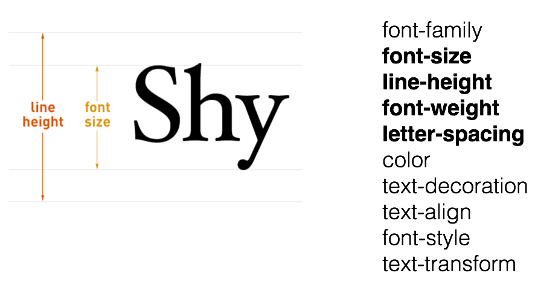
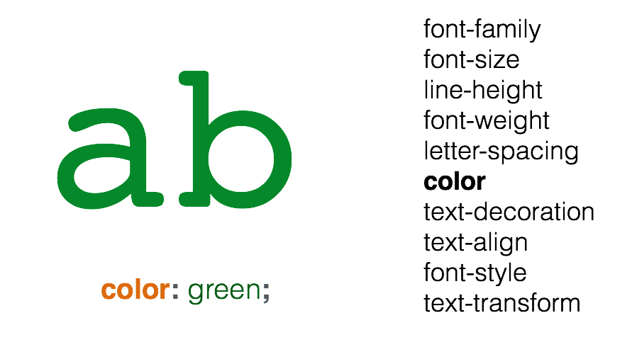
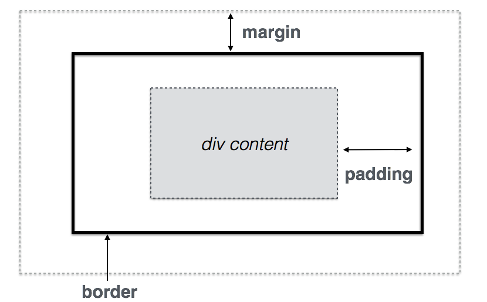
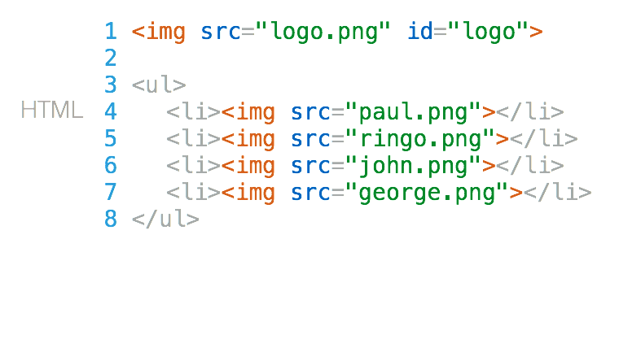
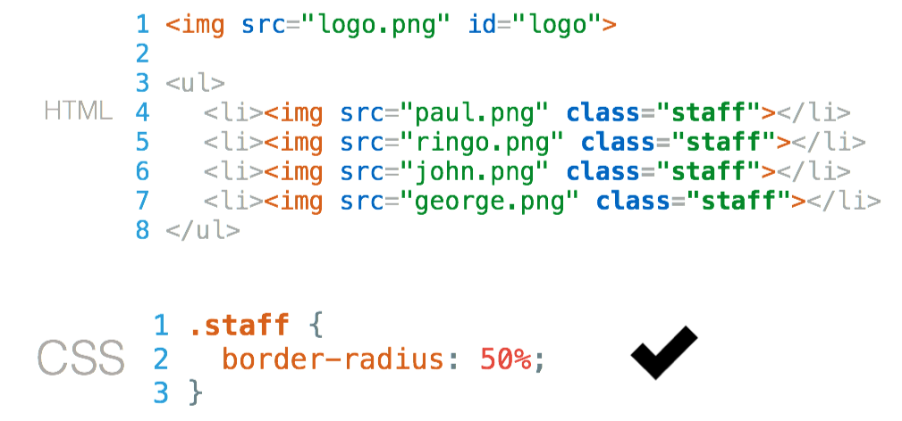
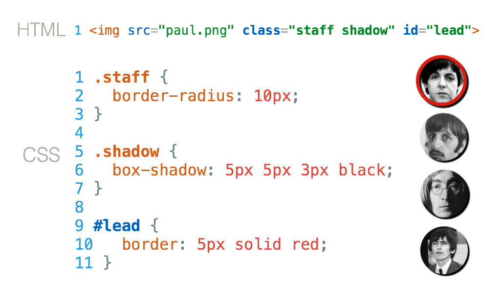
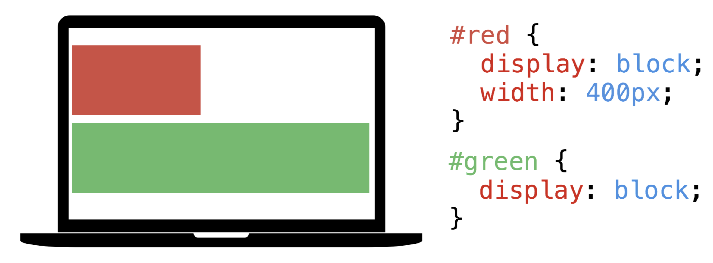
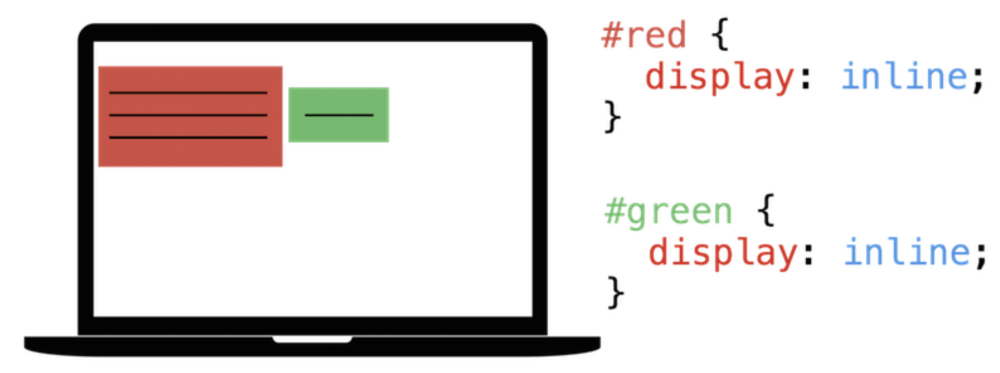

:backend: revealjs
:revealjs_theme: solarized

= Web
:source-highlighter: pygments
:pygments-style: tango

== Histoire du Web

=== Quelques dates

* 13 mars 1989, Tim Berners-Lee, engagé au CERN propose de développer un système hypertexte organisé en Web.
* 1990, les trois technologies à la base du web, URL, HTML et HTTP.
* 6 août 1991, Tim Berners-Lee rend le projet WorldWideWeb public.

=== Quelques dates pour les navigateurs

* 1993, apparitions des navigateurs Mosaic et Lynx
* 1994, Netscape Navigator
* 1995, Internet Explorer
* 1995, Javascript (dans Netscape Navigator par Brendan Eich)
* 1996, CSS

== De quoi est fait une page web ?

=== !

image:assets/html5-logo.png[html,300,300,float="left",align="center"]
image:assets/css3-logo.png[css3,300,300,align="center"]
image:assets/js-logo.png[javascript,300,300,float="right",align="center"]

=== Le contenu et sa structure

image:assets/html5-logo.png[html,350,350,align="center"]

Hypertext Markup Language

C'est le fond et des étiquettes.

=== L'apparence

image:assets/css3-logo.png[css3,350,350,align="center"]

Cascading Style Sheets

C'est la forme.

=== Pour rendre la page dynamique

image:assets/js-logo.png[javascript,350,350,align="center"]

C'est un langage de programmation.

== HTML

C'est un langage de balisage.

Les balises ou tag permettent d'identifier et de structurer le contenu.

=== Le squelette d'un fichier HTML

[source,html]
----
<!DOCTYPE html>
<html>
  <head>
    <title>Hello world</title>
    <meta charset="utf-8">
  </head>
  <body>

    <!-- Pour simplifier: le contenu affiché -->

  </body>
</html>
<!-- end of file -->
----

=== Première page

[source,html]
----
<!DOCTYPE html>
<html>
  <head>
    <title>Hello world</title>
    <meta charset="utf-8">
  </head>
  <body>

    Une page web, c'est aussi simple que cela à faire.

  </body>
</html>
<!-- end of file -->
----

=== La syntaxe d'un élément HTML:

image:assets/syntaxebalise.png[element html]

=== Exemple:

[source,html]
----
<a href="https://capes-nsi.org/" target="_blank">
  Le site du capes NSI
</a>
----

Résultat: link:https://capes-nsi.org/[Le site pour NSI]

Test:

* Quel est le nom de l'élément ?
* Citer le nom d'un attribut ? Sa valeur ?
* Quel est le contenu de l'élément ?

=== Quelques éléments HTML:

* Les titres
* Les paragraphes
* Les listes
* Les images
* Les liens

=== Les titres

[source,html]
----
<h1>[...]</h1>  <!-- Titre principal -->
<h2>[...]</h2>  <!-- Sous-titre -->
<h3>[...]</h3>  <!-- Sous-sous-titre -->
<h4>[...]</h4>  <!-- Etc.. -->
<h5>[...]</h5>
<h6>[...]</h6>
----

=== Les paragraphes

[source,html]
----

  Lorem ipsum dolor sit amet, consectetur adipisicing elit.
  Veritatis laboriosam mollitia autem at ab omnis iure quis
  asperiores inventore eos nam aut iusto officiis deserunt
  nihil, sequi tempore impedit quae?

----

=== Les paragraphes

[source,html]
----

  On peut <em>insister</em> plus particulièrement sur une
  partie du texte. On peut <strong>encore plus insister</strong>.

----

=== Les listes:

[source,html]
----
<h1>Guacamole rapide à faire</h1>

<h2>Ingrédients</h2>
<ul>
  <li>2 avocats (pelés et avec les noyaux retirés)</li>
  <li>le jus d'un citron</li>
  <li>1 petite tomate, coupée</li>
</ul>

<h2>Instructions</h2>
<ol>
  <li>Écrasez délicatement les avocats avec une fourchette</li>
  <li>Placez la purée obtenue dans un plat et arrosez avec le jus de citron</li>
  <li>Mélangez avec la tomate </li>
  <li>Gardez au frais et servir rapidement avec des tortillas</li>
</ol>
----

Elles peuvent être ordonnées `ol` ou non ordonnées `ul`.

=== Images

[source,html]
----

----

=== Les liens

[source,html]
----
<a href="https://developer.mozilla.org/fr/">
Une très bonne référence pour le HTML et le CSS.
</a>
----

== A votre tour (1)

Dans un dossier Web, copier/coller dans le fichier ``index.html``, le code de la page ci-dessous.

=== !

[source,html]
----
<!DOCTYPE html>
<html lang="fr">
  <head>
    <title>Mes films</title>
    <meta charset="utf-8">
  </head>
  <body>

    <h1>Mes films préférés</h1>
    
 Sont un prétexte pour faire du HTML..

    <a href="#"> Rejoignez-nous </a>

    <h2>Film 1</h2>
    
Vraiment un très <strong>grand</strong> film, car....

    

    <h2>Films 2</h2>
    
Une photographie incroyables incroyables

    

    <h2>Films 3</h2>
    
Une photographie incroyables incroyables

    

    
Ma liste de film

  </body>
</html>
<!-- end of file -->
----

=== Visualiser le résultat dans firefox

=== Exercice:

Modifier certains éléments:

* Enlever l'indentation sur une des lignes.
* Enlever un des 
.

Que remarque-t-on ?

=== Vérification

Il est possible d'écrire du HTML incorrect mais accepté par firefox.
Utiliser le site link:https://validator.w3.org/#validate_by_upload[w3cvalidator] pour
vérifier que votre HTML est valide.

=== Image:

Le code pour afficher des images est déjà présent.

[source, html]
----

----

Il faut seulement préciser l'adresse de l'image dans la source.

=== Adresse URL absolue

Il est possible de préciser une adresse URL absolue ou relative pour l'adresse de l'image.

Pour la première image de votre page Web, entrer dans l'attribut ``src`` l'adresse absolue suivante:

Vérifier dans firefox que l'image s'affiche.

=== Adresse URL relative

Les URL relatives sont directement inspirées de la syntaxe des systèmes de fichiers Unix.

Pour illustrer les films, créer un dossier assets et placez y des images d'illustration.

=== Adresse absolue

WARNING: Les élèves utilisent souvent une adresse absolue qui est l'adresse d'un fichier sur leur ordinateur.

== CSS

Cascading Style Sheets

=== Le web sans CSS

Aller sur
link:http://www.csszengarden.com/[www.csszengarden.com]
clic droit: examiner élément. +
Et lui "enlever la tête".

=== Lier une feuille de style

image:assets/linking-css.png[lier]

=== La syntaxe CSS

image:assets/css.png[syntaxe css]

=== Exemple:

[source,css]
----
h2 {
  color: red;
  font-size: 20px;
  font-family: courier;
}
----

=== Couleur(1)

[source,css]
----
body {
  color: orange;
}
----

=== Couleur(2)

[source,css]
----
body {
  color: #FFA500;
}
----

=== Couleur(3)

[source,css]
----
body {
  color: rgb(145, 110, 30);
}
----

=== Couleur(4)

[source,css]
----
body {
  color: rgba(145, 110, 30, 0.8);
}
----

RGBA ajoute un quatrième paramètre l'opacité.

=== Texte et arrière plan:

[source,css]
----
body {
  color: orange; /* couleur du texte */
  background-color: yellow; /* couleur du fond */
}
----

=== Fonts - family (1)
image:assets/serif.png[]

=== Fonts - family (2)

image:assets/sans-serif.png[]

=== Fonts - family (3)

image:assets/monospace.png[]

=== Fonts - size and spacing

=== Fonts - colors

== A votre tour(2)

Ajouter dans le head de ``index.html``

[source,html]
----
<link href='style.css' rel='stylesheet'>
----

=== !

Créer sauvegarder un fichier ``style.css`` dans le dossier ``ma_page``:

=== !

Copier dans ``style.css``

[source,css]
----
body {
  margin: 0px;
  color: green;
  background: rgb(245,245,245);
}
h1 {
  font-family: courier;
  color: rgb(212,57,43);
}
p {
  font-size: 30px;
  line-height: 20px;
}
----

Visualiser dans firefox

===  Modifier le code précédent pour que:

* La couleur du texte dans ``<body>`` soit noir.
* La taille du texte des paragraphes soit mieux adapté.
* La couleur des titres ``<h1>`` soit plus adapté.

=== !

Utiliser le site link:https://www.google.com/fonts[https://www.google.com/fonts]
dans votre `<head>`, pour:

* Utiliser la police de votre choix pour ``<h1>``
* La police `Open-Sans` dans tout le reste du ``<body>``

== Structurer une page

Si on va sur _n'importe quelle page web_ et qu'on examine son code, on
voit des balises `
` partout.

=== !

``div`` correspond à division, c'est pour regrouper des éléments ensemble.

Cela ne fait rien en soi.

=== !

Les cas suivants sont des divisions dont on peut identifier le sens:

* nav
* header
* footer
* article
* section

=== !

image:assets/structure_page.png[navheaderfooter, 600, 600]

=== Box model (1)

=== Box model (2)

image:assets/box-model-detailed.png[]

=== Syntaxe et raccourcis

image:assets/margin-shortcut.png[]

=== Les bordures

[source,css]
----
div {
  border-top: 1px solid red;
  border-right: 2px dotted black;
  border-bottom: 1px dashed green;
  border-left: 2px dotted black;
}
----

[source,css]
----
div {
  border: 1px solid black;
}
----

=== Validation W3C

Vous pouvez de même valider votre css ici: link:https://jigsaw.w3.org/css-validator/#validate_by_upload[https://jigsaw.w3.org/css-validator/]

== A votre tour(3)

Structurez votre HTML avec les balises ``<header>`` ``
`` et ``<footer>``

[source,html]
----
<body>
  <header>
    <h1>Mes films préférés</h1>
    
 Sont un prétexte pour faire du HTML..

  </header>

  

    <h2>Film 1</h2>
    
Vraiment super <strong>impressionnant</strong>.

    
  

  <!-- ... -->
  <footer>
    
Une liste de très bon film

  </footer>
</body>
----

== Sélecteur CSS

=== Nommer ses balises?

image:assets/id-dilemma.png[]

=== Nommer une balise avec `id`

image:assets/id-solution.png[]

=== Comment cibler plusieurs éléments ?

=== Nommer une balise avec `class`

=== `id` ou `class`?

image:assets/class-or-id.png[]

=== combiner (1)

image:assets/combine-class-1.png[]

=== combiner (2)

image:assets/combine-class-2.png[]

=== combiner (3)

=== A votre tour (1)

Nommez vos balises:

[source,html]
----
<body>
  <header id="mon_header">
    <h1>Mes films préférés</h1>
    
 Sont un prétexte pour faire du HTML..

  </header>

  

    <h2>Film 1</h2>
    
Vraiment super <strong>impressionnant</strong>.

    
  

  <!-- ... -->

  <footer id="mon_footer">
    
Ma liste de film

  </footer>

</body>
----

=== A votre tour (2)

Stylisez:

[source,css]
----
#mon_header{
  text-align: center;
  background-image: url("https://picsum.photos/1000/800/?random");
  background-size: cover;
  padding: 150px;
  color: white;
  text-shadow: 1px 1px 5px black;
}

.film {
  padding: 50px;
  font-weight: 300px;
}

.film img{
  padding: 20px;
  border: 2px solid black;
  border-radius: 50%;
}

#mon_footer{
  padding: 30px;
  background: rgb(30, 30, 30);
  color: lightgrey;
}
----

== Un peu de mise en page..

=== Block - Inline

En général, les éléments HTML sont de type: block ou inline.

=== Block

* Des éléments de type Block: h1, p, ul, ...
* Ils prennent toutes la largeur, sauf si leur largeur est précisée.
* Saut de ligne avant et après.

=== Block

=== Inline

* Des éléments de type inline: strong, em, a, img, ...
* Ils prennent la largeur de leur contenu.
* Pas de saut de ligne.

=== float

image:assets/float1.png[]

=== float

image:assets/float2.png[]

== Pour aller plus loin..

=== Un site comprenant plusieurs pages:

Il suffit tout simplement de faire plusieurs pages, avec plusieurs fichiers
`.html` et de mettre des liens entre ces pages.

L'attribut `href` de la balise `<a>`, peut prendre comme valeur le chemin
d'un fichier.

Par exemple, si deux pages se trouvent dans le même dossier:

[source,html]
----
<a href="page2.html"> Un lien vers la page 2. <a>
----

Ces pages peuvent utiliser le même fichier `css`.

=== !

Ce cours n'est qu'une très brève introduction au `html` et au `css`.

Pour en apprendre plus sur le sujet vous pouvez consulter
link:https://openclassrooms.com/courses/apprenez-a-creer-votre-site-web-avec-html5-et-css3[le site Openclassrooms].

=== Un peu de mise en page..

=== Block - Inline

En général, les éléments HTML sont de type: block ou inline.

=== Block

* Des éléments de type Block: h1, p, ul, ...
* Ils prennent toutes la largeur, sauf si leur largeur est précisée.
* Saut de ligne avant et après.

=== Block

=== Inline

* Des éléments de type inline: strong, em, a, img, ...
* Ils prennent la largeur de leur contenu.
* Pas de saut de ligne.

=== float

image:assets/float1.png[]

=== float

image:assets/float2.png[]

=== Flexbox

Pour réaliser des mises en page plus complexes, il peut être intéressant de découvrir la propriété `css`: `flexbox`:

link:https://openclassrooms.com/courses/apprenez-a-creer-votre-site-web-avec-html5-et-css3/la-mise-en-page-avec-flexbox[La partie sur flexbox d'Openclassrooms.]

=== Réaliser une barre de navigation:

Une barre de navigation est une liste de lien que l'on va styliser.

On peut pour cela utiliser la propriété `flexbox`.
